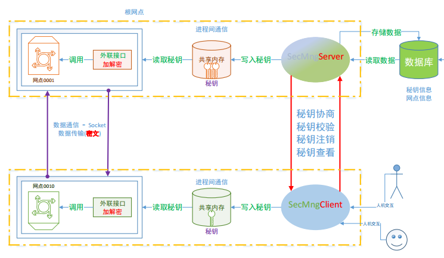

# 1. 项目整体架构图



- 网络通信
  - 数据传输 -> 需要保证数据的安全性
    - 对数据加密
  - 项目1主要实现的功能:
    - 对网络通信数据进行加解密的模块

##  项目整体模块划分

1. 基础组件
   - 数据序列化
   
     - google protobuf
   
     - 解决数据的跨平台传输
   
       - 字节序
   
       - 计算机位数
   
         - 32位
         - 64位
   
       - 字节对齐
   
         ```c
         struct A
         {
             int a;	// 4
             char b;	// 1
             char cc;
             int c;	// 4
         };
         ```
   
       - 序列化 -> 编码
   
         - 将原始数据按照某种格式进行封装 -> 特殊的字符串
         - 将特殊字符串发送给对方
   
       - 反序列化 -> 解码
   
         - 接收到序列化的特殊字符串 -> 解析	-> 原始数据
         - 安装业务需求处理原始数据
   
   - 套接字通信
   
     - tcp
     - 线程池 -> 服务器端使用
     - 连接池 -> 客户端使用
       - 多线程的使用
   
   - 共享内存操作 -> shm
   
     - 进程间通信的一种方式
     - 效率最高
       - 之前讲的进程间通信的方式都需要使用fd
         - 管道
           - 匿名 -> 不需要读磁盘
           - 有名 -> 需要磁盘文件
         - 本地套接字
         - 内存映射区 -> mmap
       - 不需要对磁盘文件进行操作
   
   - 数据库操作
   
     - 使用的oracle
     - 使用的oracle官方提供的c++接口
       - OCI
   
2. 秘钥协商服务器 && 客户端

   - 客户端两种实现模式
     - 桌面程序 -> Qt
       - 需要将桌面创建搭建起来
       - 写的qt程序
         - 业务逻辑纯C/C++实现都是可以的
     - 终端交互 -> linux终端 -> 上课时候使用这个实现
   - 服务器 -> 后台的守护进程

3. 图形界面

   - Qt的配置管理终端

4. 加解密接口（外联接口）的封装

# 2. 数据的加密和解密

## 2.1 加密三要素

```sequence
note left of 明文: Encode
明文->密文: 加密算法+秘钥
密文-->明文: 解密算法+秘钥
note right of 密文: Decode
```

- 加密三要素:
  
  - 明文/密文
  
    - 明文 -> 原始数据
    - 密文 -> 加密之后的数据
  
  - 秘钥
  
    - 定长的字符串
    - 对称加密 ->自己生成
    - 非对称加密 -> 有对应的算法可以直接生成
  
  - 算法
  
    - 加密算法
    - 解密算法
  
  - 举例:
  
    ```c
    明文: 123
    秘钥: 111
    加密算法: 明文 + 秘钥    
    解密算法: 密文 - 秘钥
    
    加密:  123 + 111 = 密文 == 234
        
    解密: 234 - 11 = 明文 == 123
    ```
  
    

## 2.2 常用的加密方式

- 对称加密
  
  - 秘钥比较短
  - 秘钥只有一个
    - 加密解密使用的秘钥是相同的
  - 加密的效率高
  - 加密强度相对较低( 相对于非对称加密 )
  - 秘钥分发困难 -> 因为秘钥要保密不能泄露
    - `秘钥不能直接在网络环境中进行发送`
  
- 非对称加密
  
  - 秘钥比较长
  - 秘钥有两个, 所有的非对称加密算法都有生成密钥对的函数
    - 这两个秘钥对保存到不同的文件中, 一个文件是公钥(比较小), 一个是私钥(比较大)
    - 公钥   -> 可以公开的
    - 私钥  -> 不能公开
  - 加解密使用的秘钥不同
    - 如果使用公钥加密, `必须`私钥解密
    - 如果使用私钥加密, `必须`公钥解密
  - 效率低
  - 加密强度相对较高( 相对于对称加密 )
  - 秘钥可以直接分发 -> 分发的公钥
  
  

#3. 常用的加密算法

## 3.1 对称加密  

- <font color="red">**DES/3DES**</font>
- DES  -> 已经被破解了, 不安全
    - 秘钥长度 8byte
  - 对数据分段加密, 每组8字节
    - 得到的密文和明文长度是相同的
  - 3DES -> 3重des
    - 安全的, 效率比较低
    - 对数据分段加密, 每组8字节
    - 得到的密文和明文长度是相同的  == 8字节
    - 秘钥长度24字节, 在算法内部会被平均分成3份, == 每份8字节
      - 看成是3个秘钥
      - 每个8字节
    - 加密处理逻辑:
      - 加密: 	-> 秘钥1  * 加密算法
      - 解密     -> 秘钥2   * 解密算法
      - 加密     -> 秘钥3   * 加密算法
    - 三组秘钥都不同, 加密的等级是最高的
- <font color="red">**AES**</font>
  - 最安全, 效率最高的公开的对称加密算法
  - 秘钥长度: 16字节, 24字节, 32字节
    - 秘钥越长加密的数据越安全, 效率越低
  - `分组加密, 每组长度 16 字节`
  - 每组的密文和明文的长度相同  == 16byte
- Blowfish
- RC2/RC4/RC5
- IDEA
- SKIPJACK

## 3.2 非对称加密

### 加密算法

- **RSA(数字签名和密钥交换)**
  - 项目中用的是rsa
- ECC（椭圆曲线加密算法 - 数字签名）
- Diffie-Hellman(DH, 密钥交换)
- El Gamal(数字签名)
- DSA（数字签名）

### 秘钥交换过程

```c
// 假设通信的双方为: 客户端C, 服务器端S
// Wie什么要交换?
/*
	1. 非对称加密秘钥分发方便, 但是效率低 -> 改进: 需要使用对称加密
	2. 使用对称加密 -> 秘钥分发困难 -> 改进: 使用非对称加密进行秘钥分发
		- 分发是对称加密的秘钥, 本质就是一个字符串
*/
// 秘钥交换的过程:
/*
	1. 在服务器端生成一个非对称加密的密钥对: 公钥, 私钥
	2. 服务器将公钥发送给客户端, 客户端有了公钥
	3. 在客户端生成一个随机字符串 -> 这就是对称加密需要使用的秘钥
	4. 在客户端使用公钥对生成的对称加密的秘钥进行加密 -> 密文
	5. 将加密的密文发送给服务器
	6. 服务器端使用私钥解密 -> 对称加密的秘钥
	7. 双方使用同一秘钥进行对称加密通信
*/
```

## 3.3 Hash算法 (单向散列函数)

> 特点: 
>
> - 不管原始数据有多长, 通过哈希算法进行计算, 得到的结果的长度是固定的
>   - 是一个二进制的字符串
> - 只要是原始数据不一样, 得到的结果就不一样
>   - 原始数据差一丢丢, 得到的结果也是完全不同的
> - 有很强的抗碰撞性
>   - 碰撞: 原始数据不同, 但是通过同样的哈希算法进行计算能得到相同的结果
>   - 推导的结论:
>    - 数据不同得到的结果就不同
>   - 应用场景:
>    - 数据校验
>     - 登录验证
>    - 秒传
> - 不可逆
>   - 得到的结果不能推导出原始数据
> 
>哈希运算的结果:
> 
>- 散列值
> - 指纹
> - 摘要

- MD4/MD5
  - 散列值长度: 16字节
  - 抗碰撞性已经被破解
- SHA-1
  - 散列值长度: 20字节
  - 抗碰撞性已经被破解
- SHA-2
  - sha224
    - 散列值长度: 224bit / 8 = 28byte
  - sha256
    - 散列值长度: 256bit / 8 = 32byte
  - sha384
    - 散列值长度: 384bit / 8 = 48byte
  - sha512
    - 散列值长度: 512bit / 8 = 64byte
- SHA3-224/SHA3-256/SHA3-384/SHA3-512


# 5. 消息认证码 -> HMAC

> 作用: 
>
> - 在通信的时候, 校验通信的数据有没有被篡改(完整性)
> - 没有加密的功能
>
> 使用:
>
> - 消息认证码的本质是一个散列值
> - `(原始数据 + 秘钥) * 哈希函数 = 消息认证码`
>   - 最关键的数据: 秘钥
>
> 校验的过程:
>
> - 数据发送方A, 数据接收方B
> - 在A或B端生成一个秘钥: X, 进行分发 -> A和B端都有了 秘钥: X
> - 在A端进行散列值运算:  (原始数据 + x) * 哈希函数 = 得到散列值
> - 在A端: 将原始数据和散列值同时发送给B
> - 在B端:  -> AB端使用的哈希算法是相同的
>   - 接收数据
>   - 校验: (接收的原始数据 + x) * 哈希函数 = 散列值New
>   - 比较散列值: 散列值New 和 接收的散列值 是不是相同
>     - 相同: 没篡改
>     - 不同: 被修改了
>
> 缺点:
>
> - 秘钥分发困难
> - 不能区分消息的所有者

# 6. 数字签名

> 作用:
>
> - 校验数据有没有被篡改(完整性)
> - 鉴别数据的所有者
> - 不能对数据加密
>
> 数字签名的过程:  -> 私钥加密数据
>
> - 生成一个非对称加密的密钥对, 分发公钥
> - 使用哈希函数对原始数据进行哈希运算 -> 散列值
> - 使用私钥对散列值加密 -> 密文
> - 将原始数据和密文一起发送给接收者
>
> 校验签名的过程:
>
> - 接收签名的一方分发的公钥
> - 接收签名者发送的数据:  `接收的原始数据 + 签名`  
> - 对数据进行判断:
>   - 对`接收的原始数据`进行哈希运算 -> 散列值new
>     - 和签名的时候使用的哈希函数相同(必须相同)
>   - 使用公钥对签名(密文) 解密 -> 得到了散列值old
>   - 比较两个散列值
>     - 相同: 数据的所有者确实是A, 并且数据没有被篡改
>     - 不同:  数据的所有者不是A或者数据被篡改了

# 4. 安装OpenSSL

### 4.1 openssl介绍

> OpenSSL 是一个安全[套接字](https://baike.baidu.com/item/%E5%A5%97%E6%8E%A5%E5%AD%97)层密码库，囊括主要的[密码算法](https://baike.baidu.com/item/%E5%AF%86%E7%A0%81%E7%AE%97%E6%B3%95)、常用的[密钥](https://baike.baidu.com/item/%E5%AF%86%E9%92%A5)和证书封装管理功能及[SSL](https://baike.baidu.com/item/SSL)协议，并提供丰富的应用程序供测试或其它目的使用。 
>
> [SSL](https://baike.baidu.com/item/SSL)是Secure Sockets Layer（[安全套接层协议](https://baike.baidu.com/item/%E5%AE%89%E5%85%A8%E5%A5%97%E6%8E%A5%E5%B1%82%E5%8D%8F%E8%AE%AE)）的缩写，可以在Internet上提供秘密性传输。[Netscape](https://baike.baidu.com/item/Netscape)公司在推出第一个[Web浏览器](https://baike.baidu.com/item/Web%E6%B5%8F%E8%A7%88%E5%99%A8)的同时，提出了SSL协议标准。其目标是保证两个应用间通信的保密性和可靠性,可在服务器端和用户端同时实现支持。已经成为[Internet](https://baike.baidu.com/item/Internet)上保密通讯的工业标准。 

