# 1. git介绍

## 1.1. 版本控制系统

- 集中式版本控制系统

  > 集中式版本控制系统，版本库是集中存放在中央服务器的，而干活的时候，用的都是自己的电脑，所以要先从中央服务器取得最新的版本，然后开始干活，干完活了，再把自己的活推送给中央服务器。
  >
  > 集中式版本控制系统最大的毛病就是必须联网才能工作，如果在局域网内还好，带宽够大，速度够快，可如果在互联网上，遇到网速慢的话，那就GG了.  

  

- 分布式版本控制系统

  > 分布式版本控制系统根本没有“中央服务器”，每个人的电脑上都是一个完整的版本库，这样，你工作的时候，就不需要联网了，因为版本库就在你自己的电脑上。
  >
  > 既然每个人电脑上都有一个完整的版本库，那多个人如何协作呢？
  >
  > 分布式版本控制系统通常也有一台充当“中央服务器”的电脑，但这个服务器的作用仅仅是用来方便“交换”大家的修改，没有它大家也一样干活，只是交换修改不方便而已。

  

# 2. 创建本地版本库

> 版本库又名仓库，英文名**repository**，你可以简单理解成一个目录，这个目录里面的所有文件都可以被Git管理起来，每个文件的修改、删除，Git都能跟踪，以便任何时刻都可以追踪历史，或者在将来某个时刻可以“还原”。

## 2.1 概念

- 工作区

  - 用户自己创建的目录 -> 存放源代码
  - 本地的版本库也需要放到工作区中
  - 每个工作区中都可以创建一个版本库
  - 只有工作区的`新文件`才需要添加到暂存区

- 版本库

  - 就是一个目录: 名字-> .git
  - 管理用于提交的代码

- 暂存区

  - 首先创建新文件 -> 在工作区 (和版本库没有关系)
  - 将新文件添加到本地仓库中 -> 新文件被保存在了暂存区 (还是没有进行版本管理)
  - 将暂存区数据提交到版本库 -> 这时候就可以进行版本管理了
  - 暂存区也是一个目录: stage/index
  
  
  
  
  
  - 提交代码的流程
    - 要在工作区中创建新文件
    - 将工作区中的新文件添加到暂存区
      - 文件只需要往暂存区添加一次
    - 将暂存区数据提交到版本仓库
      - 版本仓库中有很多节点, 依次记录着我们提交的各个版本

## 2.2 操作步骤

- 创建版本库

  - 在工作区中鼠标右键

    

    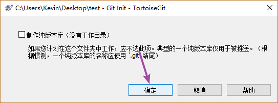

    

- 添加新文件

  - 在工作区右键菜单

    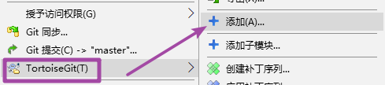

    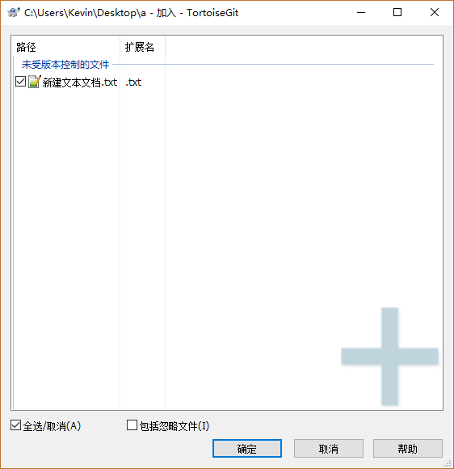

  

  

  

- 提交文件

  - 鼠标右键
  
    
    
    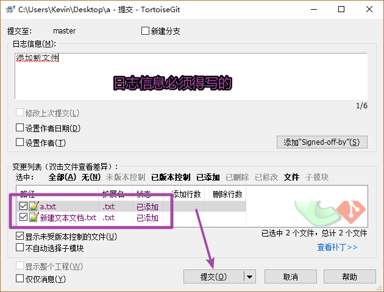
  
  

# 3. 修改文件

- 修改工作区文件

  - 修改完文件之后直接提交, 不需要再次添加到暂存区
- 修改完之后 的数据需要提交到本地的版本仓库中
  
- 还原修改

  - 还原之后数据就不能再恢复了
  
  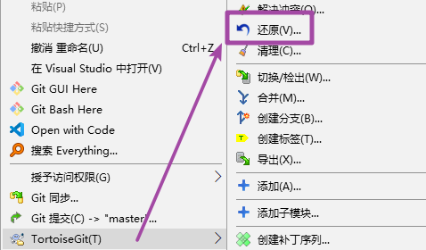

- 查看修改历史

  - 比较当前查看的版本和上一个版本的区别
  - 可以导出某一个需要的版本, 在当前版本上鼠标右键:
    - 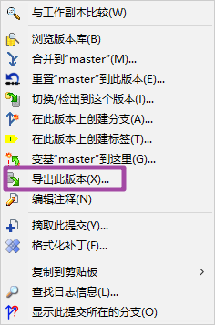
  - 

- 差异比较

  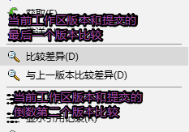

- 删除文件

  - 可以手动删除 -> delete 键
- 通过菜单项删除
  
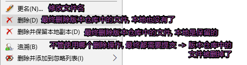
  
- 注意事项:`删除操作之后必须要提交`

# 4. 练习: 添加一个本地项目到仓库

- 设置文件忽略

  先选中要忽略的文件, 在这些文件上鼠标右键

  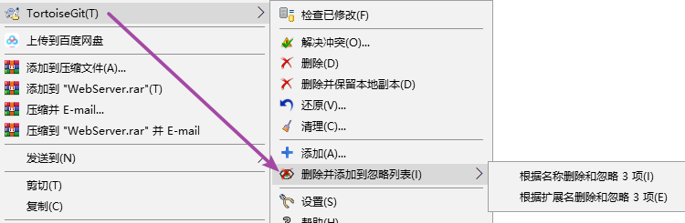

  将设置忽略的动作提交到版本库

# 5. 添加远程仓库

```c
远程仓库作用:
	- 备份本地仓库的代码
	- 多人协同开发, 使用远程仓库合并代码
远程仓库来源:
	- 公司自己搭建
	- 使用现有的远程仓库
		- github
		- 码云
```


## 5.1 添加远程仓库

在线代码托管平台 

- Github: https://github.com/
- 码云: https://gitee.com/

创建仓库

- 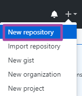
- 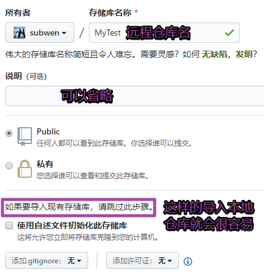
- 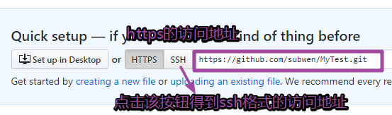

## 5.2 本地仓库同步到远程仓库

- 在工作区鼠标右键

  

  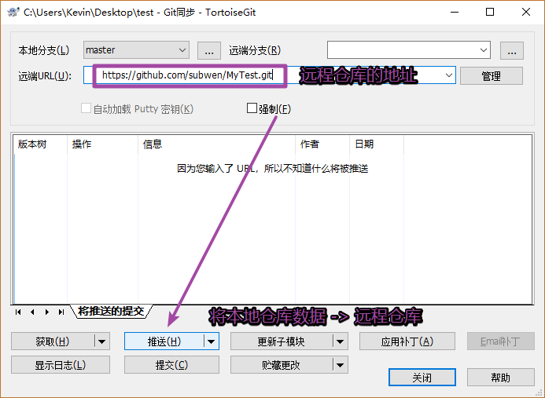

## 5.3 克隆远程仓库到本地

- 进入到远程仓库中, 找到仓库的地址

  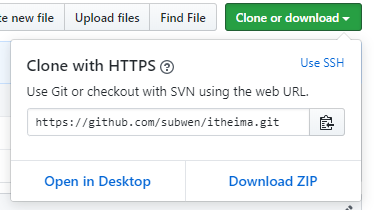

- 将远程地址复制一份

- 在本地找一个目录, 进行如下操作

  

  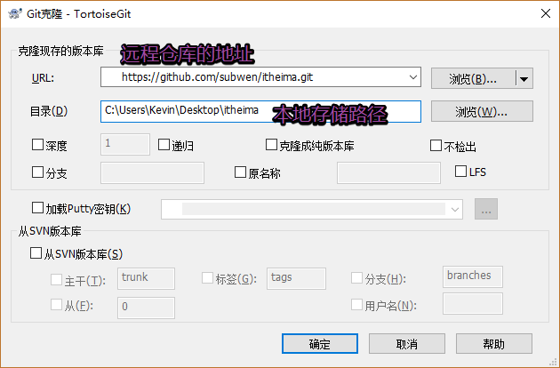

- 第一次需要将远程仓库内容下载到本地的时候, 才需要克隆

## 5.4 ssh设置

- 在本地生成一个密钥对

  - 在本地任意目录下, 鼠标右键

    

  ```shell
  $ ssh-keygen -t rsa
  ```

  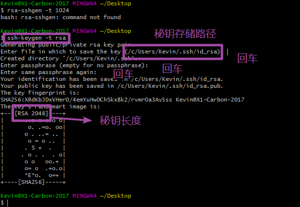

  - 本地设置ssh秘钥 -> 私钥

    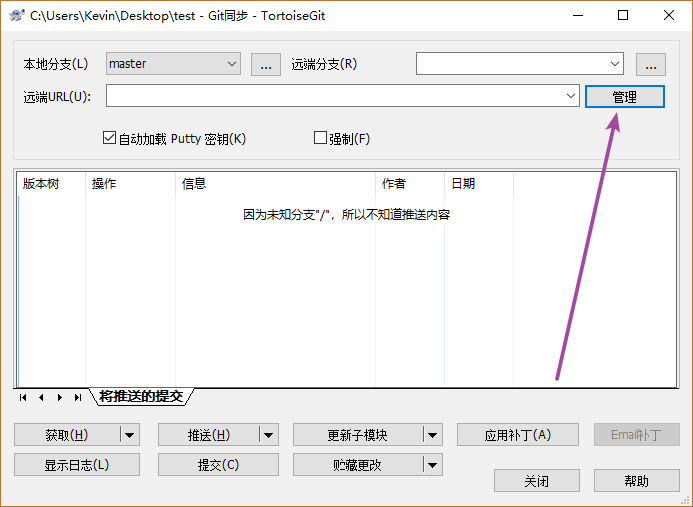

    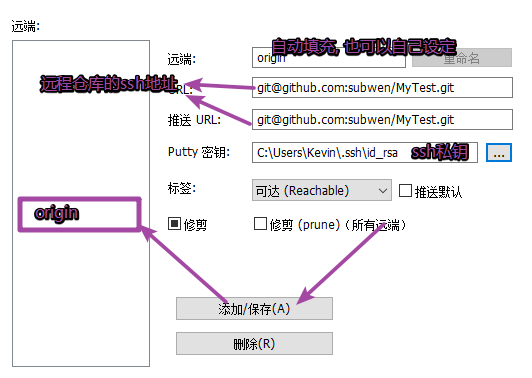

    

- 远程仓库设置公钥

  - 进入当前用户的设置界面

    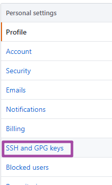

    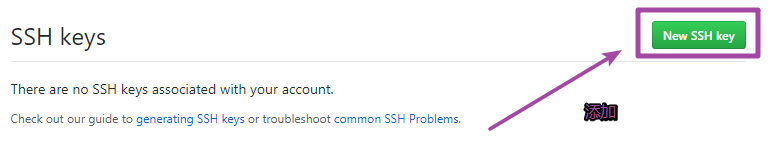

    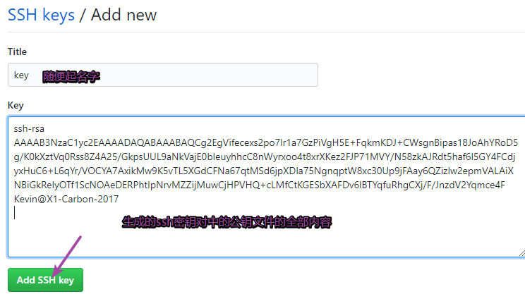

  - 使用ssh地址遇到的问题

    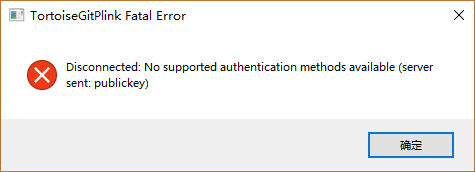

    ```shel
    # 解决方案: 需要修改tortoisegit 使用的 ssh工具
    # 需要在 tortoisegit 设置窗口中进行修改
    ```

    - 默认的路径

      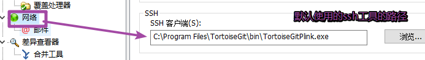

    - 修改后的路径

      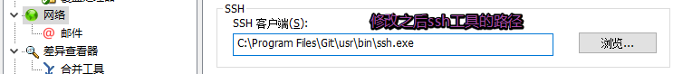

# 6. 分支管理

> 分支就是科幻电影里面的平行宇宙，当你正在电脑前努力学习Git的时候，另一个你正在另一个平行宇宙里努力学习SVN。
>
> 如果两个平行宇宙互不干扰，那对现在的你也没啥影响。不过，在某个时间点，两个平行宇宙合并了，结果，你既学会了Git又学会了SVN！
>
> 在版本仓库中有一个默认的分支:` master`, 当前仓库中有文件之后, 默认分支就被创建了
>
> ​	- 如果不创建分支, 分支默认只有一个 : master


## 6.1 创建分支

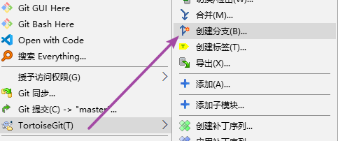

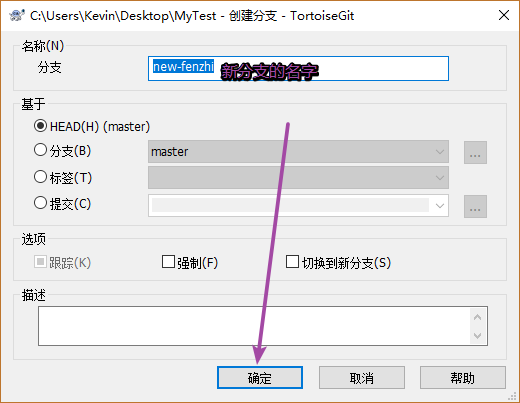

## 6.2 切换分支

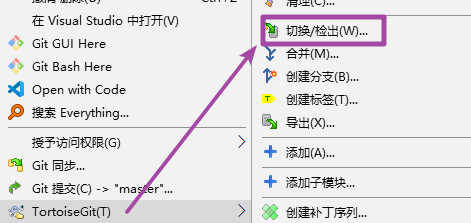

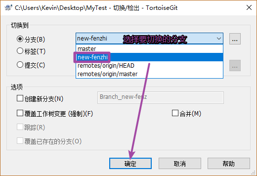

## 6.3 合并分支

> 两个分支进行合并(master, new分支), 最终要合并到那个分支(master), 就先切换到那个分支(master), 切换完成之后, 在选择把哪个分支(new分支)合并到当前分支(master)

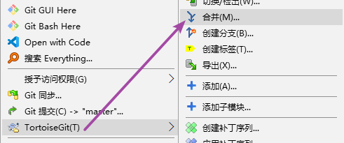

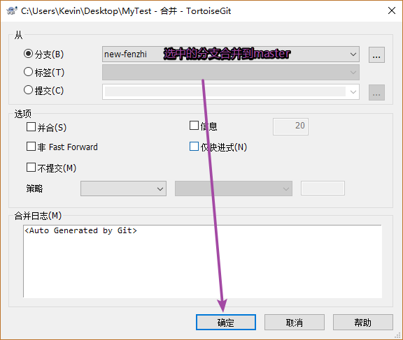

## 6.4 解决冲突

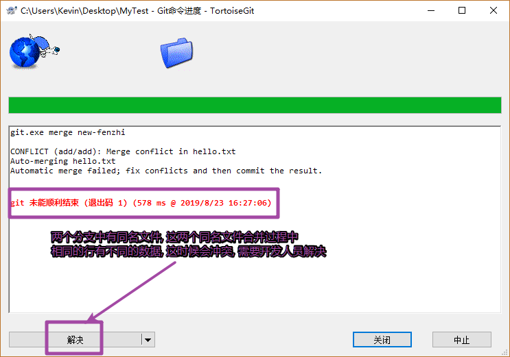

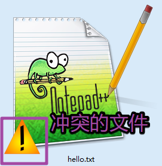

- 冲突文件的格式

  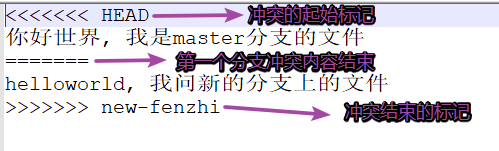

  手动修改文件内容, 修改完成之后, 解决冲突

  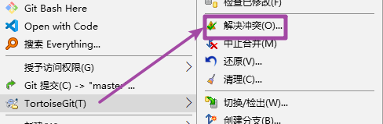

  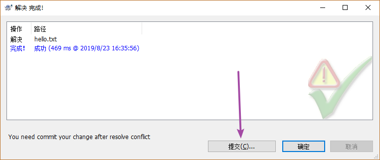

  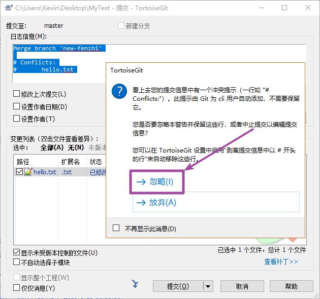

# 7. 推送文件

> 有一个远程的仓库-> github, 这不是一个空的仓库, 需要将本地的版本库提交到远程仓库
>

直接推送 -> 失败

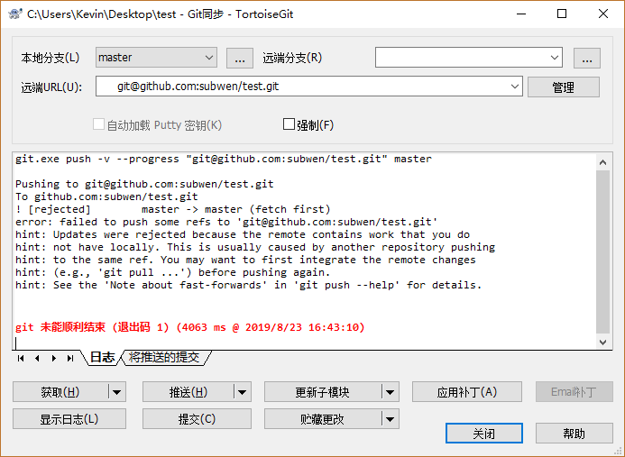

> 失败的原因:
>
> - 远程仓库不是空的
>   - 有一个默认分支, `master`
> - 本地仓库, 不是空的
>   - 有一个默认分支, `master`
> - 远程仓库和本地仓库默认分支名字相同, 但是这两个分支没有任何关系
>   - 没有关系的分支进行合并 -> 失败

- 解决方案

  > 1. 将远程仓库拉取到本地(pull)
  >    - 拉取: 直接将远程仓库分支中的信息和本地分支进行合并
  >    - 获取: 将远程仓库分支复制到本地的另外一个分支中, 不会合并
  >      - 分支名字: fetch_head
  > 2. 将两个分支进行强行合并
  > 3. 将本地分支数据推送动到远程仓库

- 通过进行获取操作, 得到新分支`FETCH_HEAD`

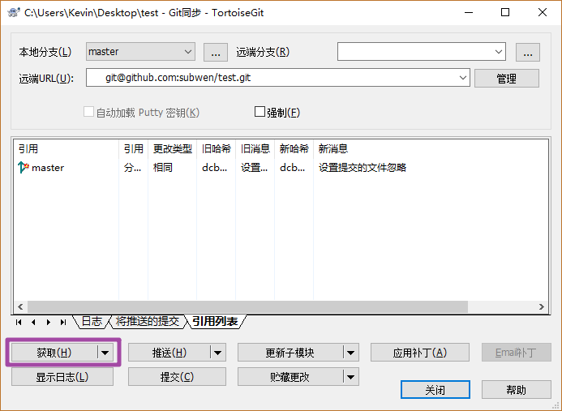

- 合并分支: 得到的新分支`FETCH_HEAD`分支合并到本地`master`分支

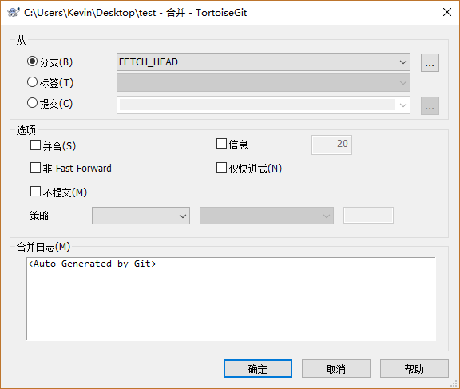

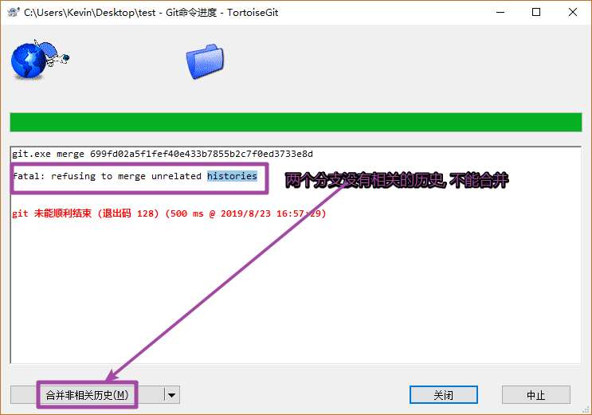

- 将本地仓库推动到远程仓库

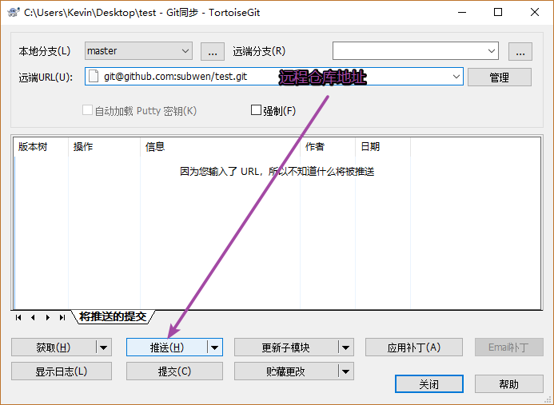

# 8. 使用最多的场景

> 远程仓库分支和本地仓库分支有关系的情况, 该如何操作?
>
> - 本地:
>   - 修改代码提交到本地仓库
>   - 提交到远程仓库
>     - 不能直接提交
>     - 在推送之前应该将远程仓库代码`拉取`到本地
>       - 进程代码合并
>         - 有可能冲突 -> 手动解决冲突
>     - 将新的代码推动到远程仓库