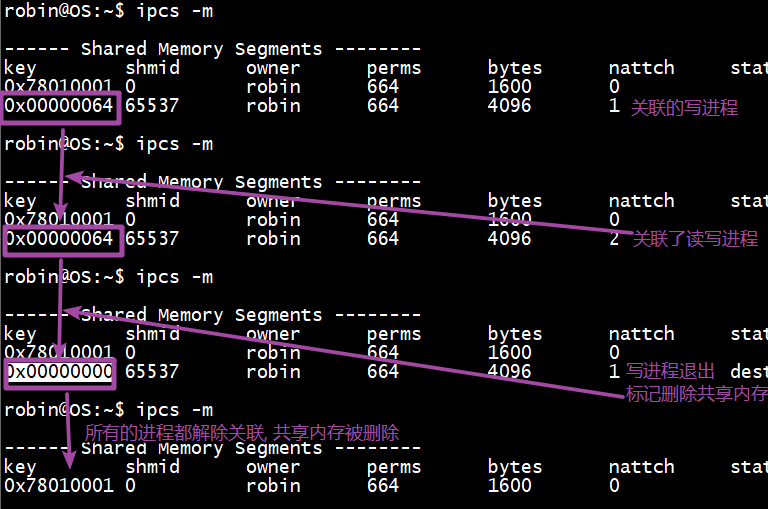

# 1. 套接字超时

```c
// 套接字通信过程中默认的阻塞函数 -> 条件不满足, 一直阻塞
// 等待并接受客户端连接
int accept(int sockfd, struct sockaddr *addr, socklen_t *addrlen);
// 通信
// 接收数据
ssize_t read(int fd, void *buf, size_t count);
ssize_t recv(int sockfd, void *buf, size_t len, int flags);
// 发送数据
ssize_t write(int fd, const void *buf, size_t count);
ssize_t send(int sockfd, const void *buf, size_t len, int flags);
// 连接服务器的时候
int connect(int sockfd, const struct sockaddr *addr, socklen_t addrlen);

// 设置超时处理的原因:
	- 不想让线程/进程一直在对应的函数(上边的函数)的位置阻塞
	- 设置一个阻塞的时间, 当时间到了之后强制线程/进程处理别的任务
// 超时处理的思路:
	- 定时器 
		- linux中可以发信号, 中断休眠
		
	- sleep(10)
        - 不可用, 在指定时间之内如果阻塞函数满足条件, 直接接触阻塞, 进行业务处理
        - 上述两种方式, 不能在程序休眠过程中解除休眠, 进行业务处理
    - IO多路转接函数:
		- 帮助我们委托内核检测fd的状态: 读/写/异常
		- 这些函数最后一个参数设置函数阻塞时长, 在阻塞过程中, 如果有fd状态发生变化, 函数直接返回

int select(int nfds, fd_set *readfds, fd_set *writefds,
                  fd_set *exceptfds, struct timeval *timeout);	// 单位: s

int poll(struct pollfd *fds, nfds_t nfds, int timeout);	// 单位: 毫秒
int epoll_wait(int epfd, struct epoll_event *events,
                      int maxevents, int timeout);		// 单位: 毫秒
```

## 1.1 accept超时

```c
// 等待并接受客户端连接
// 如果没有客户端连接, 一直阻塞
// 检测accept函数对应的fd(监听的文件描述法)的读缓冲区就可以了
int accept(int sockfd, struct sockaddr *addr, socklen_t *addrlen);

// 使用select检测状态
struct timeval {
	time_t      tv_sec;         /* seconds */
	suseconds_t tv_usec;        /* microseconds */
};
struct timeval val = {3, 0};	// 3s
// 监听的sockfd放到读集合中进行检测
fd_set rdset;
FD_ZERO(&rdset);
FD_SET(sockfd, &rdset);	// sockfd监听的文件描述符
int ret = select(sockfd+1, &rdset, NULL, NULL, &val);
if(ret == 0)
{
 	// 超时了, 最后一个参数等待时长用完了   
}
else if(ret = 1)
{
    // 有新连接
    accept();	// 绝对不阻塞
}
else
{
    // 异常, select调用失败, 返回值为 -1
}
```

## 1.2 read超时

```c
// 等待并对方发送数据到本地
// 如果对方没有发送数据, 一直阻塞
// 检测read函数对应的fd(通信的文件描述符)的读缓冲区就可以了
ssize_t read(int fd, void *buf, size_t count);

// 使用select检测状态
struct timeval {
	time_t      tv_sec;         /* seconds */
	suseconds_t tv_usec;        /* microseconds */
};
struct timeval val = {3, 0};	// 3s
// 通信的fd放到读集合中进行检测
fd_set rdset;
FD_ZERO(&rdset);
FD_SET(fd, &rdset);	// fd通信的文件描述符
int ret = select(fd+1, &rdset, NULL, NULL, &val);
if(ret == 0)
{
 	// 超时了, 最后一个参数等待时长用完了   
}
else if(ret == 1)
{
    // 有新数据达到-> 对方发送来的通信数据
    read()/recv();	// 绝对不阻塞
}
else
{
    // 异常, select调用失败, 返回值为 -1
}
```

## 1.3 write超时

```c
// 将要发送的数据写到本地写缓冲区
// 本地写缓冲区, 一直阻塞
// 检测write函数对应的fd(通信的文件描述符)的写缓冲区就可以了
ssize_t write(int fd, const void *buf, size_t count);

// 使用select检测状态
struct timeval {
	time_t      tv_sec;         /* seconds */
	suseconds_t tv_usec;        /* microseconds */
};
struct timeval val = {3, 0};	// 3s
// 通信的fd放到写集合中进行检测
fd_set wrset;
FD_ZERO(&wrset);
FD_SET(fd, &wrset);	// fd通信的文件描述符
int ret = select(fd+1, NULL, &wrset, NULL, &val);
if(ret == 0)
{
 	// 超时了, 最后一个参数等待时长用完了   
}
else if(ret == 1)
{
    // 写缓冲区可写
    write()/send();	// 绝对不阻塞
}
else
{
    // 异常, select调用失败, 返回值为 -1
}
```

## 1.4 connect 超时

> 1. Posix 定义了与 select/epoll 和 `非阻塞 connect` 相关的规定：
>    
>    - 连接过程中写缓冲区不可用
>    
>    - 连接建立`成功时`，socket 文件描述符变为`可写`。（连接建立时，写缓冲区空闲，所以可写）
>    - 连接建立`失败时`，socket 文件描述符`既可读又可写`。 （由于有未决的错误，从而可读又可写）
>    
> 2. 连接失败, 错误判定方式:
>
>    - 当用select检测连接时，socket既可读又可写，只能在可读的集合通过`getsockopt`获取错误码。

```c
// 连接服务器 -> 如果连接过程中, 函数不返回-> 程序阻塞在这个函数上, 通过返回值判断函数是不是调用成功了
// 返回值: 0 -> 连接成功, -1: 连接失败
// 默认该函数有一个超时处理: 75s, 175s
// 如果上述不能满足, 需要自己设置超时处理
// 设置超时连接处理过程:
	- 设置connect函数操作的文件描述符为非阻塞
	- 调用connect
	- 使用select检测
		- 需要getsockopt进行判断
	- 设置connect函数操作的文件描述符为阻塞 -> 状态还原
int connect(int sockfd, const struct sockaddr *addr, socklen_t addrlen);

// 获取文件描述符的状态是否有错误
int getsockopt(int sockfd, int level, int optname,
                      void *optval, socklen_t *optlen);
// 判断错误
sockfd: 文件描述符
level: SOL_SOCKET
optname: SO_ERROR
optval: int 类型, 存储错误状态
	- 没有问题: 0
    - 有问题: 保存了错误码(错误编号 > 0)
optlen: optval大小对一个的以地址
```

```c
// connect超时处理
// 设置非阻塞
int flag = fcntl(connfd, F_GETFL);
flag |= O_NONBLOCK;
fcntl(connfd, F_SETFL, flag);
// 连接服务器 -> 不阻塞了
connect(connfd, &serveraddress, &addlen);
// 通过select检测
struct timeval val = {3, 0};	// 3s
// 通信的connfd放到写集合中进行检测
fd_set wrset;
FD_ZERO(&wrset);
FD_SET(connfd, &wrset);	// fd通信的文件描述符
// 函数返回了, connect有结果了, 成功/失败 -> 过程走完了, 得到了结果
int ret = select(fd+1, NULL, &wrset, NULL, &val);
if(ret == 0)
{
 	// 超时了, connect还在连接过程中
}
else if(ret == 1)
{
    // 写缓冲区可写
    // 连接过程完成了, 得到了结果
    int opt;
    getsockopt(connfd, SOL_SOCKET, SO_ERROR, &opt, sizeof(opt));
    if(opt > 0)
    {
        // connect失败了
    }
    else if(opt == 0)
    {
        // connect连接成功了
    }
}
else
{
    // 异常, select调用失败, 返回值为 -1
}
// 将connfd状态还原 -> 阻塞
```

## 1.5 tcp通信粘包问题

> 客户端每隔1s给服务器发送一条数据, 每条数据长度 100字节 , 服务器每隔2s接收一次数据
>
> - 服务器接收一个数据得到200字节 -> 粘包
>
> 怎么造成的?
>
> - 发送的时候, 内核进行了优化, 数据到达一定量发送一次
> - 网络环境不好, 有延时
> - 接收方接收数据频率低, 一次性读到了多条客户端发送的数据
>
> 解决方案:
>
> - 发送的时候, 强制缓冲区数据被发送出去 - > flush
> - 在发送数据的时候每个数据包添加包头
>   - 包头: 一块内存, 存储了当前这条消息的属性信息
>     - 属于谁 -> char[12]
>     - 有多大 -> int
>     - ......

# 2. 共享内存

> 共享内存是进程间通信中最简单的方式之一。共享内存允许两个或更多进程访问同一块内存，当一个进程改变了这块地址中的内容的时候，其它进程都会察觉到这个更改。

1. 共享内存使用流程

   ```c
   1. 向内核申请一块内存 -> 指定大小
   2. 如果有两个进程, 需要通信, 可以使用这块共享内存来完成, 先创建出这两个进程
   	- 进程A
   	- 进程B
   3. 进程A和进程B分别和共享内存进行关联
   	- 拿到共享内存的地址 -> 首地址
   4. 两个进程可以通过这个首地址对共享内存进行读/写操作
   5. 如果这个进程不再使用这块共享内存, 需要和共享内存断开关联
   	- 进程退出, 对共享内存是没有任何影响的
   6. 当不再使用共享内存的时候, 需要将共享内存销毁
   ```

   

2. 共享内存头文件

   ```c++
   #include <sys/ipc.h>
   #include <sys/shm.h>
   ```

3. 共享内存操作函数

   - 创建或打开一块共享内存区 

     ```c
     // 创建共享内存
     // 共享内存已经存在, 打开共享内存
     // 可以创建多块共享内存
     int shmget(key_t key, size_t size, int shmflg);
     	参数:
     		- key: 通过这个key记录共享内存在内核中的位置, 需要是一个>0的整数, ==0不行
     			随便指定一个数就可以, 后边会介绍一个函数ftok
     		- size: 创建共享内存的时候, 指定共享内存的大小
     			- 如果是打开一个已经存在的共享内存, size写0就可以
     		- shmflg: 创建共享内存的时候使用, 类似于open函数的flag
     			- IPC_CREAT: 创建共享内存
     				- 创建的时候需要给共享内存一个操作权限
     					- IPC_CREAT | 0664
     			- IPC_CREAT | IPC_EXCL: 检测共享内存是否存在
     				- 如果存在函数返回-1
                     - 不存在, 返回0
     	返回值:
     		成功: 创建/打开成功, 得到一个整形数 -> 对应这块共享内存
     		失败: -1
     // 应用
     // 1. 创建共享内存
     int shmid = shmget(100, 4096,  IPC_CREAT | 0664);
     int shmid = shmget(200, 4096,  IPC_CREAT | 0664);
     // 2. 打开共享内存
     int shmid = shmget(100, 0, 0);  
     ```
     
   - 将当前进程和共享内存关联到一起

     ```c
     // 进程和共享内存产生关系
     void *shmat(int shmid, const void *shmaddr, int shmflg);
     	参数:
     		- shmid: 通过这个参数访问共享内存, shmget()函数的返回值
     		- shmaddr: 指定共享内存在内核中的位置, 写NULL -> 委托内核区指定
     		- shmflg: 关联成功之后对共享内存的操作权限
     			- SHM_RDONLY: 只读
     			- 0: 读写
     	返回值:
     		成功: 共享内存的地址 (起始地址)
             失败:  (void *) -1
     // 函数调用:
     void* ptr = shmat(shmid, NULL, 0);
     // 写内存
     memcpy(ptr, "xxxx", len);
     // 读内存
     printf("%s", (char*)prt);
     ```

   - 将共享内存和当前进程分离

     ```c
     // 进程和共享内存分离 -> 二者就没有关系了
     int shmdt(const void *shmaddr);
     	参数: 共享内存的起始地址, shmat()返回值
     	返回值:
     		- 成功: 0
             - 失败: -1
     ```
     
   - 共享内存操作 -（ 删除共享内存 ）

     ```c
     // fcntl
     // setsockopt
     // getsockopt
     // 对共享内存进程操作
     int shmctl(int shmid, int cmd, struct shmid_ds *buf);
     	参数: 
     		- shmid: 通过这个参数访问共享内存, shmget()函数的返回值
     		- cmd: 对共享内存的操作
     			- IPC_STAT: 获取共享内存的状态
     			- IPC_SET: 设置共享内存状态
     			- IPC_RMID: 标记共享内存要被销毁
     		- buf: 为第二个参数服务的
     			cmd==IPC_STAT: 获取共享内存具体状态信息
     			cmd==IPC_SET: 自定义共享内存状态, 设置到内核的共享内存中
     			cmd==IPC_RMID: 这个参数没有用了, 指定为NULL
     	返回值:
     		成功: 0
             失败: -1
     // 删除共享内存
     shmctl(shmid, IPC_RMID, NULL);
     ```

4. 思考问题

   - 问题1: 操作系统如何知道一块共享内存被多少进程关联?

     - 共享内存维护了一个结构体`struct shmid_ds`这个结构体中有一个成员`shm_nattch`
     - `shm_nattch`中记录了关联的进程的个数
     
   - 问题2: 是不是可以对共享内存进行多次删除 -> 多次调用`shmctl`

     - 可以多次操作
   - 因为`shmctl`函数是标记删除共享内存, 部署直接删除
     - 什么时候被真正删除了?
     - 当关联这块共享内存进程个数 == 0 的时候, 真正被删除了
         - `shm_nattch== 0` 

     

     当共享内存的key == 0的时候
     
     - 共享内存被标记删除, 并且还有进关联这块共享内存
     - 当key==0, 没有和共享内存进程关联的进程, 就不允许进行关联了
       - 只为已经关联成功的进程服务
     
     
     

5. shm和mmap的区别

   > 1. shm可以直接创建, 内存映射区创建的时候需要依赖磁盘文件
   >    - 内存映射区匿名映射不能进行无血缘关系的进程通信
   > 2. shm效率更高
   >    - shm直接对内存操作
   >    - mmap需要同步磁盘文件
   > 3. 内存共享
   >    - 所有的进程操作的是同一块内存 -> shm
   >    - 内存映射区操作:
   >      - 每个进程都会在自己的虚拟地址空间中有一块独立的内存
   > 4. 数据安全性
   >    - 进程突然退出
   >      - 共享内存还在
   >      - 内存映射区消失了
   >    - 运行进程的电脑突然挂了 -> 死机
   >      - 数据存储在共享内存中 -> 没有
   >      - 内存映射区中的数据 -> 还有
   >        - 内存映射区需要关联磁盘文件, 二者是同步的
   > 5. 生命周期
   >    - 内存映射区: 进程退出, 内存映射区销毁
   >    - 共享内存: 进程退出, 共享内存还在, 手动删除, 或者关机


5. ftok 函数原型

   ```c
   key_t ftok(const char *pathname, int proj_id);
   	- 参数pathname: 对应某个存在的路径或路径中的对应的文件名 - 绝对路径
   		- /
           - /home/robin/a/b/c
           - /usr/local/lib
           - /home/itcast/a.txt
   	- 参数proj_id: 目前只使用了该变量占用的内存的一部分(1个字节)
           取值范围: 0 - 255
   key_t t = ftok("/home/", 'a');
   shmget(t, 0, 0);
   
   ```

# 3. 共享内存操作命令

1. ipcs 用法

   ```shell
   ipcs -a 	// 打印当前系统中所有的进程间通信方式的信息
   ipcs -m		// 打印出使用共享内存进行进程间通信的信息   ==  常用
   ================ 以下为了解内容 ================
   ipcs -q 	// 打印出使用消息队列进行进程间通信的信息
   ipcs -s 	// 打印出使用信号进行进程间通信的信息
   ```

2. ipcrm 用法

   ```shell
   # key == shmget的第一个参数
   ipcrm -M shmkey  	// 移除用shmkey创建的共享内存段
   # id == shmget的返回值
   ipcrm -m shmid		// 移除用shmid标识的共享内存段
   ================ 以下为了解内容 ================
   ipcrm -Q msgkey		// 移除用msqkey创建的消息队列
   ipcrm -q msqid		// 移除用msqid标识的消息队列
   ipcrm -S semkey		// 移除用semkey创建的信号
   ipcrm -s semid		// 移除用semid标识的信号
   ```


# 4. 共享内存API封装

```c++
//shmget
int shmget(key_t key, size_t size, int shmflg);
class BaseShm
{
public:
    BaseShm(int key);	// 根据key打开共享内存
    BaseShm(string path);	// 根据string path-> int key 打开共享内存
    BaseShm(int key, int size);	// 根据key创建共享内存
    BaseShm(string path, int size);	// 根据string path-> int key 创建共享内存
    
    void* mapshm()
    {
        m_ptr = shmat(shmid);
        return m_ptr;
    }
    int unmapshm()
    {
       	shmdt(m_ptr);
    }
    int delshm()
    {
        shmctl(shmid);
    }
    
private:
    int m_shmid;	// shmget返回值
    void* m_ptr;
}
```

