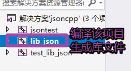
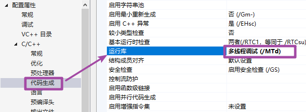

# 1. JsonCpp使用

```json
1. Json是什么?
	- 不是语言, 跟语言无关
	- 是数据的一种描述形式, 以某种格式将数据组织起来
		- 写磁盘文件 -> 配置文件
			- 在应用程序启动的时候, 需要加载少量数据, 初始化应用程序
				- 登录的用户名, 密码
				- 远程数据库连接
				- 连接的远程服务器地址
				- 让程序更加灵活
		- 网络发送   -> 报文
			- 对数据进行序列化
2. json的如何组织数据?
	- json数组 -> 
		- 类似 C++ 中的数组, []表示, 元素之间使用逗号间隔
		- 区别: json的数组的数据类型可以不同
		- 注意事项事项: 最后一个元素后边不要写逗号, 否则会解析失败
		- 可包含的数据类型: [int, double, float, bool, string, char*, json数组, json对象]
		- 举例:
			[12, 13.45, "hello, world", true, false, [1,2,"aa"], {"a":"b"}]
	- json对象
		- 使用{}表示
		- 分为两部分, key: value
			- 键值对之间使用都被间隔, 最后一个键值对后边不要写逗号, 否则会解析失败
			- key: 必须是字符串, 对要存储的数据的描述
			- value: 要保存的数据, 数据格式可以有多种: 
				- 整形, 浮点, 字符串, 布尔, json数组, json对象
		- 例子:
			{
                "name":"蕾蕾",
                "age":12,
                "sex":"man",
                "婚否":flase,
                "falily":["爸爸", "妈妈", "弟弟"],
                "资产":{
                    "car":"BMW",
                    "房子":"北京故宫"
                }
            }

	- 以上两种格式可以嵌套使用
```


## 1.1 安装

- windows 下的安装

  - 在windows下 将 `jsoncpp-0.10.7.tar.gz`解压缩

  - 进入到解压目录`jsoncpp-0.10.7`, 在进入到子目录`makefiles\msvc2010`

  - 使用`vs`打开项目文件`jsoncpp.sln`

  - 编译该项目, 生成库文件

    

  - 生成的静态库存储目录`jsoncpp-0.10.7\makefiles\msvc2010\Debug`

  - 生成的静态库文件: `lib_json.lib`

  - 使用的准备工作:

    - 将静态库`lib_json.lib`拿出备用
    - 将库对应的头文件拿出, 头文件目录`jsoncpp-0.10.7\include\json`

  - vs编译过程中, 修改属性

    

- Linux 下的安装

  - 准备安装包

    - `jsoncpp-0.10.7.tar.gz`
    - `scons-3.0.5.zip`

  - 解压缩

    ```shell
    $ tar zxvf jsoncpp-0.10.7.tar.gz
    $ unzip scons-3.0.5.zip
    ```

  - 安装scons -> 进入 `scons-3.0.5.zip` 的解压目录

    ```shell
    $ python setup.py install 
    ```

  - 安装 jsoncpp -> 进入 `jsoncpp-0.10.7.tar.gz` 的解压目录

    ```shell
    $ scons platform=linux-gcc 
    # 将生成的动态库/静态库拷贝到系统的库目录中, 需要管理员权限
    $ cp libs/linux-gcc-4.8.5/* /lib
    # 拷贝json的头文件到系统目录中, 需要管理员权限
    $ cp include/json/ /usr/include/ -r
    # 创建动态库的链接文件, 需要管理员权限
    ln -s /lib/libjson_linux-gcc-4.8.5_libmt.so /lib/libjson.so
    # 更新, 这样才能搜索到动态库 libjson.so。需要管理员权限
    $ ldconfig	
    # 测试
    $ ./bin/linux-gcc-4.8.5/test_lib_json 
    Testing ValueTest/checkNormalizeFloatingPointStr: OK
    Testing ValueTest/memberCount: OK
    Testing ValueTest/objects: OK
    Testing ValueTest/arrays: OK
    ..................
    Testing BuilderTest/settings: OK
    Testing IteratorTest/distance: OK
    Testing IteratorTest/names: OK
    Testing IteratorTest/indexes: OK
    All 53 tests passed
    ```

  - 编译 c++ 测试文件： json-test.cpp

    ```shell
    $ g++ json-test.cpp -ljson -o json
    ```

## 1.2 jsoncpp类的使用

- Value -> 对Json支持的数据类型进行封装/解析

  ```c++
  // Json支持的数据类型
  Type = {int, double, float, string, char*, bool, JsonArray, JsonObject}
  // 构造函数
    Value(ValueType type = nullValue);
    Value(Int value);
    Value(UInt value);
  #if defined(JSON_HAS_INT64)
    Value(Int64 value);
    Value(UInt64 value);
  #endif // if defined(JSON_HAS_INT64)
    Value(double value);
    Value(const char* value); ///< Copy til first 0. (NULL causes to seg-fault.)
    Value(const char* begin, const char* end);
  
  // 将Value对象转换成对应类型的数据
    Int asInt() const;
    UInt asUInt() const;
  #if defined(JSON_HAS_INT64)
    Int64 asInt64() const;
    UInt64 asUInt64() const;
  #endif // if defined(JSON_HAS_INT64)
    LargestInt asLargestInt() const;
    LargestUInt asLargestUInt() const;
    float asFloat() const;
    double asDouble() const;
    bool asBool() const;
  
  // 判断Value对象中存储的数据的类型
    bool isNull() const;
    bool isBool() const;
    bool isInt() const;
    bool isInt64() const;
    bool isUInt() const;
    bool isUInt64() const;
    bool isIntegral() const;
    bool isDouble() const;
    bool isNumeric() const;
    bool isString() const;
    bool isArray() const;
    bool isObject() const;
  
  // 取值 
  // 格式化 -> 将对象转换为字符串
  // 适合于查看信息或者写文件
  std::string toStyledString() const;
  
  ```

  

- Reader

  ```c++
  // json格式字符串 -> Value对象
  // c++
  bool parse(const std::string& document, Value& root, bool collectComments = true);
  	参数:
  		- document: json字符串, 传入参数
  		- root: 传出参数, 转换完成之后的Value对象
  // c用法
  bool parse(const char* beginDoc, const char* endDoc, 
             Value& root, bool collectComments = true);
  	参数:
  		- beginDoc: 字符串起始地址
  		- endDoc: 字符串结束地址
  		- root: 传出参数, 转换完成之后的Value对象
  // c++用法
  bool parse(std::istream& is, Value& root, bool collectComments = true);
  	参数:
  		- is: 文件流对象, 使用这个流对象打开一个磁盘文件
  		- root: 传出参数, 转换完成之后的Value对象
  ```

  

- FastWriter

  ```c++
  // 将Value对象中的数据格式化 -> 字符串
  // 适合于网络数据的发送
// 得到的字符串中没有换行符
  std::string write(const Value& root);
  
  // 得到这个返回值:
  	- 写磁盘 -> 写到配置文件中
  	- 网络传参数
  ```
  
  

# 2. 秘钥协商客户端


- 客户端的配置文件

  ```json
  // clientID, serverID, IP, Port
  {
      "clientID":"bj_tbd_001",
      "serverID":"bj_gugong_001",
      "serverIP":"127.0.0.1",
      "ServerPort":8888
  }
  ```
  
- 客户端的实现:

  - 在客户端发起请求
    - 秘钥协商
    - 秘钥校验
    - 秘钥注销
  - 客户端需要提供和用户交互的功能
  - 客户端和服务器通信需要携带数据
    - 通信的业务数据
    - 鉴别客户端身份的数据 -> 客户端的ID
    - 和客户端通信的服务器ID
    - 需要一个标记 -> 服务器根据这个标记判定客户端要请求做什么事儿 -> 事先约定好即可
      - 1 -> 秘钥协商
      - 2 -> 秘钥校验
      - 3 -> 秘钥注销
    - 给对方提供校验数据, 判断数据块是不是被修改了
      - 签名 -> RSA签名

- 数据分析

  ```c++
  //客户端使用的结构体
  struct RequestMsg
  {
  	int cmdType;	
      string clientID;
      string serverID;
      string sign;
      string data; 
  };
  
  message RequestMsg
  {
  	int32 cmdType=1;	
      bytes clientID=2;
      bytes serverID=3;
      bytes sign=4;
      bytes data=5; 
  }
  
  // 数据分析
  cmdType: 发送给服务器的数据, 服务器需要对去进行判断:
  	- 1 -> 秘钥协商
  	- 2 -> 秘钥校验
  	- 3 -> 秘钥注销
  clientID: 所有有效的客户端都会被分配给一个有效的唯一的ID
  serverID: 客户端要连接的服务器对应的ID
  data: 对应的业务数据, 根据cmdType不同而不同
  sign: 签名, 对data签名
  ```

  

- 秘钥协商客户端通信流程

  - 提供一个能够和用户交互的界面
  - 用户选择的秘钥协商
  - 组织数据, 初始化`struct RequestMsg`
    - `cmdtype` = 1
    - `clientID` = `读配置文件`
    - `serverID` = `读配置文件`
    - `data` = `非对称加密的公钥`
    - `sign` = `data的签名`
  - 对数据`struct RequestMsg`进行序列化 -> 字符串
    - `protobuf` 对应的类
  - 数据发送给服务器
    - 套接字通信的类也封装好了 - `TcpSocket`
      - 创建一个通信对象
      - 连接服务器
        - `服务器IP, 服务器端口` == > 来自与配置文件
      - 给服务器发送序列化之后的数据
      - 接收数据 (默认是阻塞的)-> 等待服务器回复数据 
      - 接收到了服务器回复的数据 -> `反序列化`
        - 使用封装的序列化类就可以完成此操作
      - 得到了原始数据
        - 将对此加密的秘钥进行解析 -> 这是公钥加密的数据
          - 通过私钥解密 -> 原始的对称加密的秘钥

  

  

# 3. 秘钥协商服务器

- 被动接受客户端请求, 不需要和用户进行交互
  - 可以是以守护进程
  - 接收客户端请求, 处理 -> 给客户端回复数据
    - 请求的处理状态
    - 针对业务逻辑处理得到的业务数据
    - 

- 数据分析

  ```c
  // 服务器给客户端回复的数据
  struct RespondMsg
  {
  	bool status;
      int seckeyID;
      string clientID;
      string serverID;
      string data;
  };
  status: 客户端请求的处理状态
  data: 	实际的业务数据
  clientID: 秘钥协商客户端的ID
  serverID: 秘钥协商服务器的ID
  seckeyID: 只要在秘钥协商生成新秘钥的时候才有用
  ```
  
  

- 服务器进行秘钥协商通信流程

  - 启动服务器并设置监听
  
    - `服务器端port` = 配置文件中读
    
  - 服务器必须能接收多客户端连接
  
    - 多线程/IO多路转接
  
  - 成功和客户端建立了连接 -> 等待接收客户端请求的数据
  
  - 收到客户端请求数据 ->解析
  
    - 序列化之后的数据
      - 数据反序列化 -> 结构体
  
  - 根据`cmdType` 判断客户端想要干什么
  
    ```c
    switch(cmdType)
    {
        case 1:
            秘钥协商();
            break;
        case 2:
            秘钥校验();
            break;
        case 3:
            秘钥注销();
            break;
        default:
            break;
    }
    ```
  
  - 用户请求是秘钥协商
  
    - 验证客户端的身份
      - `clientID, serverID` 验证是不是有效ID
      - `sign` = > 校验这个签名
    - 真正的秘钥协商
      - 生成一个随机字符串 
        - 对称加密的秘钥
      - 使用得到的公钥进行加密 -> 密文
      - 初始化回复的数据`struct RespondMsg`
        - `status` = true/false
        - `data` = 密文
        - `clientID, serverID` = 通过服务器端数据进行初始化
        - `seckeyID`  = 生成新秘钥的时候才需要初始化这个变量
      - 序列化要发送的数据`struct RespondMsg` -> 字符串
      - 通过网络通信进行发送 -> 客户端
  
  ​          

# Centos升级gcc/g++

## gcc 4.9

```shell
$ wget https://copr.fedoraproject.org/coprs/rhscl/devtoolset-3/repo/epel-6/rhscl-devtoolset-3-epel-6.repo -O /etc/yum.repos.d/devtoolset-3.repo
$ yum -y install devtoolset-3-gcc devtoolset-3-gcc-c++ devtoolset-3-binutils
$ scl enable devtoolset-3 bash
```

## gcc 5.2

```shell
$ wget https://copr.fedoraproject.org/coprs/hhorak/devtoolset-4-rebuild-bootstrap/repo/epel-6/hhorak-devtoolset-4-rebuild-bootstrap-epel-6.repo -O /etc/yum.repos.d/devtoolset-4.repo
$ yum install devtoolset-4-gcc devtoolset-4-gcc-c++ devtoolset-4-binutils -y
$ scl enable devtoolset-4 bash
```

## gcc 6.3

```shell
$ yum -y install centos-release-scl
$ yum -y install devtoolset-6-gcc devtoolset-6-gcc-c++ devtoolset-6-binutils
$ scl enable devtoolset-6 bash
```

> 需要注意的是scl命令启用只是临时的，退出shell或重启就会恢复原系统gcc版本。
> 如果要长期使用gcc 6.3的话：

```shell
$ echo "source /opt/rh/devtoolset-6/enable" >>/etc/profile
```

> 这样退出shell重新打开就是新版的gcc了
> 其他版本同理，修改devtoolset版本号即可。

## gcc 7.3

```shell
$ yum -y install centos-release-scl
$ yum -y install devtoolset-7-gcc devtoolset-7-gcc-c++ devtoolset-7-binutils
$ scl enable devtoolset-7 bash
```

> 需要注意的是scl命令启用只是临时的，退出shell或重启就会恢复原系统gcc版本。
> 如果要长期使用gcc 7.3的话：

```shell
$ echo "source /opt/rh/devtoolset-7/enable" >>/etc/profile
```

