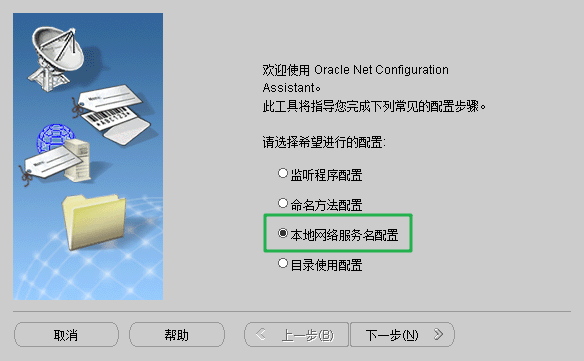
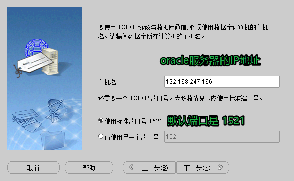

# 1. 共享内存

- shm


- 秘钥协商服务器和协商客户端部署在同一台主机?

  - 实际的应用场景是部署在不同的主机上
  
- 实际场景应该是什么场景?

  - 网络通信使用的加密方式:
    - 对称 -> 效率高
      - 秘钥分发困难, 不能直接分发
      - 使用非对称加密对对称加密的秘钥进程加密 -> 密文
        - 公钥加密, 只有私钥才能解开
        - 发送密文
  - 场景: 
    - 服务器端发送消息 -> 传智共屏软件 -> 服务器 -> 独立进程
      - 加密使用对称加密的秘钥
      - `部署秘钥协商的服务器`端程序
        - 独立进程
      - 最终的需求:
        - 秘钥协商生成的秘钥给到传智共屏服务器
          - 这两个进程没关系 -> 没有血缘关系
          - 效率最高: 共享内存(shm)
    - 客户端接收消息 -> 传智共屏软件 -> 客户端 -> 独立进程
      - 解密, 使用对称加密的秘钥
      - `部署秘钥协商的客户端`程序
        - 独立进程
      - 最终的需求:
        - 秘钥协商生成的秘钥给到传智共屏客户端
          - 这两个进程没关系 -> 没有血缘关系
          - 效率最高: 共享内存(shm)

- 服务器和客户端共享内存中的秘钥个数?

  - 服务器端:
  - 秘钥多个, 应服务器需要和多客户端连接
    - 每个客户端对应一个加密的秘钥, 这些秘钥都是不同的
  - 客户端:
    - 需要秘钥1个
      - 一个客户端只需要和一个服务器进行连接
  
- 共享内存中存储的秘钥信息都有什么?

  ```c
  struct SecKeyInfo
  {
      // 初始化
      SecKeyInfo()
      {
          key = string();
          clientID = string();
        ...
          status  = true;
      }
      // 对称加密的秘钥
      string key;
      // 如果鉴别这个秘钥属于谁 -> 查询秘钥的时候根据clientID和serverID进行查询
      string clientID;
      string serverID;
      // 可选 -> 秘钥编号ID
      int seckeyID;
      // 可选 -> 秘钥状态
      bool status;	// true:可用, false:不可用
  }
  
  SecKeyInfo info;
  memset(&info, 0, sizeof(info));	// error, 成员是string不能做memset操作
  ```
  
- 之前写的共享内存的类

  ```c++
  class BaseShm
  {
  public:
  }
  ```

  

# 2. 数据操作

## 2.1 连接数据库前的准备工作

如果想要通过外部客户端连接oracle服务器, 必须先关闭防火墙。

通过linux命令关闭centos防火墙:

- 第一种方式:

  ```shell
  # 工具 iptables
  # 安装工具iptables
  # 切换到root用户, -代表用户的环境变量一并切换
  su - root
  yum install iptables
  
  # 查看防火墙状态
  service iptables status
  # 打开防火墙
  service iptables start
  # 关闭防火墙
  service iptables stop
  ```

- 第二种方式 -> 常用

  ```shell
  # 操作系统自带的, 不需要安装任何工具
  # 假设防火墙默认是开启的, 使用关闭命令关闭之后, 再重启系统, 防火墙还是启动的
  systemctl status firewalld
  # 启动防火墙 -> 临时设置, 重启系统会回复为默认设置
  systemctl start firewalld
  # 关闭防火墙 -> 临时设置, 重启系统会回复为默认设置
  systemctl stop firewalld
  
  # 永久设置
  # 防火墙启动
  systemctl enable firewalld
  # 防火墙关闭
  systemctl disable firewalld
  ```

## 2.1 启动oracle数据库

> 必须登录到oracle用户, 通过oracle用户对数据进行启动

- 启动数据库

  ```shell
  # 通过sqlplus进行连接
  # 使用dba身份登录oracle的时候是不对密码进行验证的, 用户名使用system
  # 使用dba身份登录, 如果指定的用户名不是system也会默认使用system身份登录
  sqlplus 用户名/密码 as sysdba
  sqlplus system/xxx as sysdba
  # 启动数据库
  SQL> startup
  ORACLE instance started.
  
  Total System Global Area  759943168 bytes
  Fixed Size                  2217224 bytes
  Variable Size             549456632 bytes
  Database Buffers          205520896 bytes
  Redo Buffers                2748416 bytes
  Database mounted.
  Database opened.
  ```

  

- 关闭数据库

  ```shell
  SQL> shutdown immediate
  ```

  

- 设置tns监听

  ```shell
  $ lsnrclt start/stop
  ```

  > 如果上述操作失败: 

  ```shell
  启动tns监听失败:
  # 当前是oracle用户, 切换到root 用户
  hostname oracle
  # 退出root用户
  exit
  # 启动tns监听
  lsnrclt start
  ```
  
  

# 2. OCCI

> Oracle C++调用接口 -- OCCI 即 Oracle C++ Call Interface
>
> OCCI 是Oracle 的C++ API, 允许你使用面向对象的特性、本地类、C++语言的方法来访问Oracle数据库  

## 3.1 OCCI 介绍

1. 优势

   > 1. 基于标准C++和面向对象的设计；
   > 2. 效率较高；
   > 3. 适合开发C/S模式的程序，软件中间层；

2. 特性

   > 1. 完整支持SQL/PLSQL
   > 2. 为不断增长的用户和请求提供了弹性选项
   > 3. 为使用用户自定义类型，如C中的类，提供了无缝接口
   > 4. 支持所有的Oracle数据类型以及LOB types（大对象）
   > 5. 可以访问数据库元数据

3. OCCI 头文件

   ```c++
   #include <occi.h>   -- 程序中只需要包含这一个头文件
   #include <occiCommon.h>
   #include <occiControl.h>
   #include <occiData.h>
   #include <occiObjects.h>
   
   ```

4. OCCI 库

   - 如何在windows下得到对应的occi的库和头文件
     - 从官方下载oracle客户端安装程序并且安装
       - 在对应的安装目录就可以找到头文件和库文件
     - 从官方直接下载官方编译好的库和头文件, 部署到window对应的目录下即可
     - 官方提供的库需要和vs的版本对应, 如果版本不对应, 就无法使用
       - 关闭提供的最新的版本支持到 vc14 -> vs2015
         - vs2017 0-> vc14.1
   
   - Windows
     - oraocci11.lib/ oraocci11d.lib
     - oraocci11.dll/ oraocci11d.dll
   - Linux
     - libnnz11.so 
     - libocci.so
     - libclntsh.so

## 3.2 OCCI使用

```c++
// 头文件
#include <occi.h>
// occi的接口类在对应的命名空间中
using namespace oracle::occi;

// 使用
1. 初始化一个环境->对应的类: Environment
2. 使用初始化完成的环境对象创建一个连接, 得到一个连接对象: Connection, 通过这个对象可用连接并操作服务器
3. 对数据库的操作: 添删查改(对应相关的sql语句)
    	- 通过得到的连接数据库的实例对象, 创建一个可以对象数据进行sql操作的一个对象: Statement
4. 如果对数据进行是查询操作, 会得到一个结果集, 这个结果集对应的也是一个类: ResultSet
5. 释放资源
	- 结果集资源->ResultSet
	- 对数据进行sql操作的对象->Statement
	- 销毁连接对象->Connection
	- 数据连接环境->Environment
```


### 3.2.1 初始化 - Environment 类

> OCCI通过创建一个Environment的对象完成初始化工作。
>
> 可以通过Environment创建数据库连接，从而进行其它的操作
>
> 要创建Environment，应该调用Environment类的静态方法**createEnvironment()**

```c++
// 环境初始化
Environment* env = Environment::createEnvironment();
// 关闭, 释放资源
Environment::terminateEnvironment(env);
```

### 3.2.2 连接数据库 - Connection 类

> 连接数据库通过Connection类的对象实例实现
>
> 调用Environment类的**createConnection()**方法可以创建一个Connection对象；

```c++
// 函数原型: 
// 连接串格式: IP:端口/数据库实例名
Connection *Environment::createConnection( 
    const string &userName,const string &password, const string &connectString );
```

```c++
// 函数调用
const string userName = "scott";	// 用户名
const string passwd = "tiger";	// 密码
const string connstr = "192.168.247.129:1521/orcl";	// 数据库连接串
Connection* conn = env->createConnection(userName, passwd, connstr);
```

> 使用**Environment::terminateConnection()**断开连接

```c++
// 断开连接
env->terminateConnection(conn);
```

### 3.2.3 执行SQL

> Statement 类用于执行SQL语句,并获取返回结果。
>
> ResultSet 类用于处理SELECT 查询的结果。
>
> 对于所有类型的数据的绑定或者获取，OCCI都提供了统一的方法
>
> - setXXX  方法用于Statement
> - getXXX 方法用于Statement & ResultSet
>
> OCCI会自动处理类型之间的转换。
>
> 使用方法：
>
> 使用Connection::**createStatement()**创建Statement对象, 指定 SQL 命令(DDL/DML/query)作为参数

```c++
// 操作函数
Connection::createStatement(string &sql);

Statement::setSQL(string &sql);

Statement::execute(string &sql); 	  // can be used for any SQL, returns status
// 执行一个insert/update/delete
Statement::executeUpdate(string &sql); // returns Insert/Update/Delete count
// 执行一个select语句
Statement::executeQuery(string &sql);  // returns ResultSet（结果集）
```

> 使用 setXXX 方法传递要绑定用于输入的值
>
> 使用合适的execute方法执行SQL
>
> 对于SELECT 查询, 使用ResultSet 对象处理返回结果

```c++
// 插入操作
Statement *stmt = conn->createStatement(“ insert into Dept(Deptno,Dname, Loc) values (1, ‘ACCOUNTS’, ‘ZONE1’ ”);
stmt->executeUpdate();  
conn->terminateStatement(stmt);       // 关闭查询, 释放资源
```

> 使用绑定参数的DML（数据操作语句）示例：

```c++
Statement *stmt = conn->createStatement(“ insert into  Emp(EmpNo,Ename) values(:1, :2) ”);  
//1 and 2 are bind placeholders  
int empno = 2;  
string empname = “JOHN W”;  
//first parameter is bind position, second is value  
stmt->setInt(1, empno);   
stmt->setString(2, empname);  
stmt->executeUpdate();  
```

> 执行SELECT查询并处理结果： 

```c++
Statement *stmt = conn->createStatement(
    “select Empno, Ename, Sal from Emp where Hiredate >= :1”);  
  
//automatically converted to Date  
stmt->setString(1, “01-JAN-1987”);  
  
//executeQuery returns a ResultSet  
ResultSet *rs = stmt->executeQuery();   
  
//ResultSet::next fetches rows and returns FALSE   
//when no more rows  
while (rs->next() == true)  
{  
   //get values using the getXXX methods of ResultSet  
   empno = rs->getInt(1);  
   empname = rs->getString(2);  
   empsalary = rs->getFloat(3);  
}  
stmt->closeResultSet(rs);//to free resources 
```

## linux下的客户端环境搭建

- 如果是一个访问oracle服务器的客户端对linux的版本没有要求
- 过程: 
  - 将`oracle_client_11gR2.tar.gz`压缩包放到任意的linux系统中
  - 建议在`opt`目录解压缩, 得到`instantclient_11_2`
  - 进入到`instantclient_11_2`中

## 知识点回顾

### oracle解锁用户

```sql
需要先使用管理员登录数据库
// 解锁用户
ALTER USER scott ACCOUNT UNLOCK;
// 重新设置密码
ALTER USER scott IDENTIFIED BY tiger; 

修改上述sql语句中小写字母的部分
```


# 创建数据连接名

- 

- 

- 

- 

- 

- 

- 

- 以上信息会被写入到配置文件中

  ```c
  // C:\OracleClient\product\11.2.0\client_1\network\admin\tnsnames.ora
  
  oracle 客户端 安装根目录\product\11.2.0\client_1\network\admin\tnsnames.ora
  ```

  

- 

- 

- 秘钥信息表

  

- 网点信息表

  

# vs下occi的使用

- 头文件路径:

  ```shell
  C:\OracleClient\product\11.2.0\client_1\oci\include
  oracle客户端的安装根目录\product\11.2.0\client_1\oci\include
  ```

- 库目录

  ```shell
  C:\OracleClient\product\11.2.0\client_1\oci\lib\msvc\vc9
  oracle客户端的安装根目录\product\11.2.0\client_1\oci\lib\msvc\vc9
  如果是
  	vs2015: vc14
  	vs2017: vc14.1
  ```

  

oracle管理员: `system`

用户密码: `System11g`

