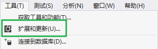
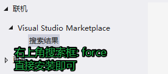
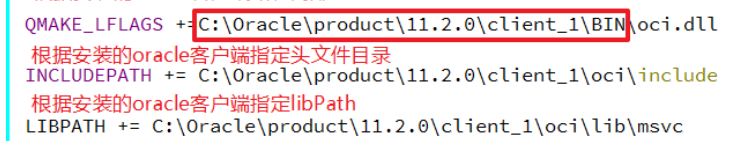

# 1. vs中安装utf8编码插件





# 2. Qt中的数据操作



- 注意事项:
  - qtcreate的编译套件一般是32bit
    - oci.dll也应该是32bit的动态库

## 2.1 在QT中 的数据库操作

- 在Qt中进行数据库操作需要使用的类: `QSqlDataBase`

  - 属于的模块: `sql`

  - 使用这个类可以创建出一个连接数据库服务器的实例

    - 单例

  - 相关的操作函数

    ```c++
    // 打印qt支持的数据库驱动的名字
    // QSQLITE QMYSQL QMYSQL3 QODBC QODBC3 QPSQL QPSQL7
    [static] QStringList QSqlDatabase::drivers()
    // 添加一个数据库实例
    [static] QSqlDatabase QSqlDatabase::addDatabase(const QString &type, const QString &connectionName = QLatin1String( defaultConnection ))
        参数:
    		- type: 连接什么样的数据库, 不同的数据库对应不同的type字符串
    		- connectionName: 连接名, 在一个项目中连接2个及以上数据库的时候需要指定连接名
    // 得到通过addDatabase函数添加的实例对象
    [static] QSqlDatabase QSqlDatabase::database(const QString &connectionName = QLatin1String( defaultConnection ), bool open = true)
    // 关闭数据库连接
    void QSqlDatabase::close();
    
    // 初始化要连接远程数据库服务器信息
    // 设置远程数据库服务器地址
    void QSqlDatabase::setHostName(const QString &host);
        - host: 可被解析的域名, 或者是一个IP地址
    // 设置连接的服务器监听的端口
    // 这个函数可以不调用, 如果数据库的监听的默认端口没有被修改过, 就不需要进行setPort的设置
    void QSqlDatabase::setPort(int port);
    // 设置数据实例名(数据库名)
    void QSqlDatabase::setDatabaseName(const QString &name);
    // 设置数据库用户
    void QSqlDatabase::setUserName(const QString &name);
    // 设置数据库密码
    void QSqlDatabase::setPassword(const QString &password);
    
    // 连接数据库
    // 返回true-> 连接成功, false-> 连接失败
    bool QSqlDatabase::open();
    
    // 事务相关
    bool QSqlDatabase::transaction();
    // 提交事务
    bool QSqlDatabase::commit();
    // 数据回滚
    bool QSqlDatabase::rollback();
    ```

  - 数据库查询的类: `QSqlQuery`

    ```c++
    // 构造函数
    QSqlQuery::QSqlQuery(const QString &query = QString(), QSqlDatabase db = QSqlDatabase());
    // 执行一个sql语句, 可以在构造对象的时候指定, 也可以在exec的时候指定
    bool QSqlQuery::exec();
    bool QSqlQuery::exec(const QString &query);
    
    // 如果是查询数据库, 会得到一个结果集, 结果可以保存在 QSqlQuery 对象中
    // 遍历结果集, 一条记录一条记录的遍历
    bool QSqlQuery::next();
    // 得到每条记录中的字段值
    QVariant QSqlQuery::value(int index) const;
    	- index: 字段在当前记录中的编号, 从0开始
    QVariant QSqlQuery::value(const QString &name) const;
    	- name: 字段的名字
    ```

    

# 3. qt中json相关的操作类

```c++
// 常用类一共有四个
QJsonDocument
QJsonArray
QJsonObject
QJsonValue

// 使用json实际场景: json数据在内存, json数据在磁盘中
// 数据在磁盘文件中
1. 读磁盘文件 -> 字符串 -> json格式
2. json格式字符串 -> json数组/对象
	- 通过QJsonDocument进行转换
3. 使用QJsonArray或QJsonObject api对数据进行操作
```


```c++
// json格式字符串 -> json文档对象
[static] QJsonDocument QJsonDocument::fromJson(const QByteArray &json, QJsonParseError *error = Q_NULLPTR);
// 判断文档对象中存储的是数组还是对象
bool QJsonDocument::isArray() const;
bool QJsonDocument::isObject() const;
// 文档对象转换为数组
QJsonArray QJsonDocument::array() const;
// 文档对象转换为jsonobject
QJsonObject QJsonDocument::object() const;
```


```c++
// 在内存中组织一个json数组/json对象 -> 写文件/发送
1. 创建json数组/json对象 (空数组/对象)
2. 添加数据
	- jsonarray: append, insert
	- jsonobject: insert
3. 将jsonarray, jsonobject -> QJsonDocument对象
	QJsonDocument::QJsonDocument(const QJsonObject &object);
	QJsonDocument::QJsonDocument(const QJsonArray &array);
4. QJsonDocument对象中的数据 -> 字符串
	QByteArray QJsonDocument::toJson(JsonFormat format = Indented) const;
5. 比如要写磁盘
	QFile
```


