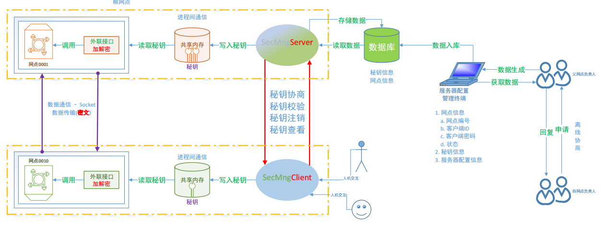

# 1. 智能指针

c++中文文档: [https://zh.cppreference.com/w/%e9%a6%96%e9%a1%b5](https://zh.cppreference.com/w/首页)

> 为了更容易（同时也更安全的管）的使用动态内存，新的标准库（C++11）提供了两种智能指针（smart pointer）类型来管理动态对象。智能指针的行为类似于常规指针。重要的区别是它负责自动释放所指向的对象。新标准提供的这两种智能指针的区别在于管理底层指针的方式：shared_ptr允许多个指针指向同一个对象；unique_ptr则独占所指向的对象。
>
> week_ptr -> 管理shared_ptr
>
> auto_ptr  -> c++17
>
> **智能指针也是模板。**

- 头文件

  ```c++
  #include <memory>
  ```

- 一般格式

  ```c
  shared_ptr<string> p1;  //指向string的shared_ptr
  shared_ptr<int> p2;   	//指向int的shared_ptr
  ```

## 1.1 shared_ptr

```c
int * a = new int(100);
// 使用智能指针和一块内存进行管联, 这块内存就有一个引用计数, 关联一次引用计数+1
// 当内存引用计数减为 0 时候, 内存就被指针指针删除了
```


> **shared_ptr 允许有多个指针指向同一个对象**, **我们可以认为每个share_ptr都有一个关联的计数器，通常称为引用计数（reference count）。无论何时我们拷贝一个shared_ptr，计数器都会递增。**<font color="red">一旦某个对象的引用计数变为0，这个对象会被自动删除。</font>
>
> 例如这些都会使所关联的计数器**递增**：
>
> **（1）当用一个shared_ptr初始化另外一个shared_ptr**
>
> **（2）将它作为参数传递给另外一个函数**
>
> **（3）作为函数的返回值**
>
>  
>
> 例如这些操作会使计数器都会**递减：**
>
> **（1）给share_ptr赋新的值**
>
> **（2）share_ptr被销毁**
>
> **（3）局部的share_ptr离开作用域**

- 初始化

  ```c
  // 通过 shared_ptr 的构造函数，可以让 shared_ptr 对象托管一个 new 运算符返回的指针
  shared_ptr<T> ptr(new T);  // T 可以是 int、char、类等各种类型
  // 使用make_shared函数分配一个对象并初始化它，make_shared函数返回一个指向此对象的shared_ptr
  template< class T, class... Args >
  shared_ptr<T> make_shared( Args&&... args );
  // 通过另一个智能指针初始化
  shared_ptr<T> ptr = ptr1;
  shared_ptr<T> ptr(ptr1);
  ```

- 查看引用计数

  ```c++
  long use_count() const noexcept;
  ```

- 返回存储的指针

  ```c++
  T* get() const noexcept;
  ```

- 重置管理的指针

  ```c++
  void reset( Y* ptr );
  ```

- 删除器 -> 回调函数 -> 删除智能指针管理的内存

  ```c
  // 默认, 删除器函数, 会自动调用
  default_delete()
  shared_ptr<int> ptr(new int(2), default_delete<int>());
  // share_ptr 的 默认删除器, 不能删除new的数组内存, 需要自己指定删除器函数
  // 通过share_ptr的构造函数, 在构造函数的第二个参数的位置上, 指定回调函数
  // 匿名函数
  [](args)
  {
  }
  
  	shared_ptr<int> ptr1(new int[10], [](int *array) {
  		delete[]array;
  	});
  	shared_ptr<A> ptr2(new A[10], [](A* a) {
  		delete []a;
  	});
  // 规律:
  删除器函数需要一个参数, 参数类型: 智能指针管理的内存地址的类型, 函数体中进行内存释放
  删除器函数别智能指针调用的时候, 会将new得到的内存地址, 传递给删除器函数的参数
  ```

## 1.2 unique_ptr

> **unique_ptr独占所指向的对象。**同一时刻只能有一个 unique_ptr 指向给定对象(通过禁止拷贝语义, 只有移动语义来实现)

- 初始化

  ```c
  // 使用构造函数
  unique_ptr<T> ptr(new T);  // T 可以是 int、char、类等各种类型
  // 使用make_unique
  template< class T, class... Args >
  unique_ptr<T> make_unique( Args&&... args );
  ```

- unique_ptr 支持对数组内存管理

# 2. 外联接口

1. 接口类的封装

   ```c++
   // 读共享内存中的秘钥, 进行对称加密
   // des , 3des , aes
   class MyInterface
   {
   public:
       // json参数磁盘的json格式的配置文件
       MyInterface(string json);
       ~MyInterface();
       // 数据加密
       // 参数: 待加密的数据->明文, 返回值: 密文
       string encryptData_des(string str);
       string encryptData_3des(string str);
       string encryptData_aes(string str);
       // 数据解密
       // 参数: 待解密的数据-密文, 返回值: 明文
       string decryptData_des(string str);
       string decryptData_3des(string str);
       string decryptData_aes(string str);
   }
   ```

2. 提供的接口不是一个应用程序 -> 不是进程

   - 如果从共享内存中读数据?
     - 虽然接口不是程序, 但是要被业务程序调用
       - 业务程序是进程
         - 通过业务程序完成进程间通信
   - 外联接口要求必须要通用
     - 必须用通过配置文件读配置信息 -> 找到共享内存

3. json格式配置文件的定义

   ```json
   // 共享内存中存储的节点结构
   class NodeSecKeyInfo
   {
   public:
   	NodeSecKeyInfo() : status(0), seckeyID(0)
   	{
   		bzero(clientID, sizeof(clientID));
   		bzero(serverID, sizeof(serverID));
   		bzero(seckey, sizeof(seckey));
   	}
   	int status;		// 秘钥状态: 1可用, 0:不可用
   	int seckeyID;	// 秘钥的编号
   	char clientID[12];	// 客户端ID, 客户端的标识
   	char serverID[12];	// 服务器ID, 服务器标识
   	char seckey[128];	// 对称加密的秘钥
   };
   ```

   

   ```json
   // 服务器端, 必须能找到对应的秘钥
   {
       "ShmKey":"/usr/lib",	// 通过 shmKey 打开一块已经存在的共享内存
       "MaxNode":100,			// 共享内存中存储的最大节点数 -> 用于遍历
       "ServerID":"999",		// 当前秘钥协商服务器的ID
       "ClientID":"666"		// 和当前业务服务器通信的客户端ID --> 这个是动态的
   }
   
   // 客户端
   {
       "shmKey":"/usr/local",	// 通过 shmKey 打开一块已经存在的共享内存
       "MaxNode":1,			// 共享内存中存储的最大节点数 -> 用于遍历
       "ServerID":"999",
       "ClientID":"666"
   }
   ```

   ```json
   // 改进配置文件
   // 将配置文件中的serverID和clientID去掉
   // 找秘钥的方式:
   	- 通过clientID和serverID进行查找
   	- 通过秘钥ID查找
   
   // 通过配置文件打开共享内存
   {
       "shmKey":"/usr/local",	// 通过 shmKey 打开一块已经存在的共享内存
       "MaxNode":1,			// 共享内存中存储的最大节点数 -> 用于遍历
   }
   
   ```

   ```c++
   // 共享内存类修改
   class SecKeyShm : public BaseShm
   {
   public:
   	// 打开或创建一块共享内存
   	// 这个操作是在父类中做的
   	SecKeyShm(int key, int maxNode);
   	SecKeyShm(string pathName, int maxNode);
   	~SecKeyShm();
   
   	void shmInit();
   	int shmWrite(NodeSecKeyInfo* pNodeInfo);
   	NodeSecKeyInfo shmRead(string clientID, string serverID);
   	NodeSecKeyInfo shmRead(int keyID);
   	// 通过这个函数读共享内存中的第一个NodeSecKeyInfo
   	// 给客户端使用
   	NodeSecKeyInfo shmFirstNode();
   
   private:
   	int m_maxNode;
   };
   ```

   

4. 如何给用户使用?

   - 将接口打包成库(静态/动态)

     - 静态库

       ```c
       // 生成.o
       gcc/g++ *.c/*.cpp -c
       // 打包.o
       ar rcs libxxx.a  *.o
       ```

     - 动态库

       ```shell
       # 生成.o -> 和位置无关使用的是相对地址
       gcc/g++ *.c/*.cpp -c -fpic
       # 生成动态库
       gcc/g++ -shared *.o -o libxxx.so
       ```

       

   - 发布对应的头文件即可


# 3.其他操作

## 3.1 OCCI - ORA-24550

在使用occi多线程访问oralce服务器的时候, 会出现ORA-24550 错误, 错误信息如下: 

```shell
ORA-24550 : signal received : [si_signo=11] [si_errno=0] [si_code=50] [si_adr =
2020202020202020] killed
```

该错误会导致进程终止, 修改方案如下:

1. 使用find命令所有oracle服务器端的 `sqlnet.ora` 文件, 在文件中添加下配置项: 

   ```shell
   DIAG_ADR_ENABLED=OFF
   DIAG_SIGHANDLER_ENABLED=FALSE
   DIAG_DDE_ENABLED=FALSE
   ```

2. 如果该问题还未解决, 在调用 `OCCI` 接口的客户端对应oracle目录中, 例如, 我的客户端对用的oralce目录为
   `/opt/instantclient_11_2` , 在该目录下的 `network/admin` 中添加文件 `sqlnet.ora` , 内容如下: 

   ```shell
   SQLNET.AUTHENTICATION_SERVICES= (NTS)
   NAMES.DIRECTORY_PATH= (TNSNAMES,HOSTNAME)
   DIAG_ADR_ENABLED=OFF
   DIAG_SIGHANDLER_ENABLED=FALSE
   DIAG_DDE_ENABLED=FALSE
   ```

## 3.2 秘钥校验

对比通信双方使用的秘钥是否相同

- 如何比较?
  - 在客户端将秘钥进行哈希计算 -> 哈希值
  - 将哈希值发送给服务器
  - 服务器端也将秘钥生成哈希值
  - 两个哈希值进行对比即可

## 3.3 秘钥注销

- 现有的共享内存中的秘钥不用了, 标记为不可用
  - 客户端:
    - 将本地共享内存中的秘钥状态进行修改
    - 通知服务器这个秘钥不用了
    - 将这个秘钥的ID发送给服务器
  - 服务器端:
    - 通过秘钥的ID找到共享内存中的秘钥, 标记为不可用
    - 更新数据库中这个秘钥的状态




1. 配置管理终端

   - 功能
     - 管理后台数据库 -> oracle
     - 网点信息的添加和修改/删除
     - 秘钥信息的查看
   - 知识点:
     - qt中的数据库操作
     - Qt中json配置文件的读写
     - qt中简单控件的使用, 创建的搭建

2. 秘钥协商

   - 秘钥协商服务器

   - 密钥协商客户端

     - 这两部分不会部署在同一台主机上

   - 知识点:

     - 套接字通信
       - tcp
         - 粘包问题
         - 阻塞的超时处理
           - 使用IO转接函数
         - 类的封装
     - 数据的跨平台传输
       - 数据的序列化
         - protobuf
         - json
     - 设计模式
       - 工厂模式
       - 简单工厂模式
         - 创建对象, 实现了多态的子类对象
       - 单例模式
         - 对象永远只有一个
     - 配置文件 -> json
       - 解析: 使用jsoncpp
         - Value
         - Reader
         - FastWriter
     - 秘钥交换(秘钥分发) -> RSA
       - 有公钥的一方生成一个随机字符串 -> 对称加密的秘钥
       - 使用公钥对称对称加密的秘钥加密 -> 密文
       - 将密文发送到有私钥的一方
       - 有私钥的一方使用私钥解密 -> 对称加密的秘钥
     - 数据签名 -> RSA
       - 目的: 
         - 检测数据有没有被篡改(数据的完整性)
         - 校验数据的所有者
       - 签名:
         - 对原始数据进行哈希原始 -> 哈希值
         - 使用私钥对哈希值加密 -> 密文
         - 将密文和原始数据发送出去 -> 等待那公钥的人校验
       - 校验签名:
         - 接收数据: 密文 + 原始数据
         - 对原始数据进行哈希原始 => 哈希值2
         - 使用公钥对密文解密 -> 哈希值1
         - 比较两个哈希值
     - 哈希算法
       - md5
       - sha1
       - sha224, sha256, sha384, sha512
     - oracle数据库操作
       - 使用官方的occi接口
         - 进行了封装 -> 针对于实际的业务
       - 数据读写二进制/中文
         - 使用base64
           - 对容易发生错乱的数据进行编解码
           - base64可逆

   - 共享内存

     - 效率高
     - 进程间通信 
       - 传递的数据是生成的秘钥
     - 秘钥协商客户端
       - 存储1个秘钥
     - 秘钥协商服务器端
       - 存储多个秘钥
     - 封装两个类
       - 创建/打开共享内存
       - 子类 -> 处理实际的业务

   - 外联接口 -> 中间件

     - 读共享内存
     - 使用得到的秘钥对数据进行加解密
       - 对称加密的方式
         - aes
     - 打包成功动态库进行发布
       - 动态库
       - 头文件

   - 业务模块

     - 对应的是独立的进程 -> 处理业务逻辑

     - 要求:

       - 涉及到网络通信

       - 数据有安全的需求

       - 在编写的时候: 有几个功能

         - 这些功能要求能够进行描述

       - 建议:

         - 上传/下载功能

           - 使用线程池

             ```c++
             // 封装的类
             // 任务结构体
             struct Task
             {
             	Task()
             	{
             		function = nullptr;
             		arg = nullptr;
             	}
             	void *(*function)(void *);     /* 函数指针，回调函数 */
             	void *arg;                     /* 上面函数的参数 */
             };
             // 任务队列类
             	- 管理任务
             	- 任务的组成:
             		- 函数指针, 指向一个功能函数, 这函数中的操作最终被子线程处理
             		- arg: 给回调函数传参
             		
             // 线程池类
             	- 管理了多个线程
             		- 管理者线程 -> 1个
             			- 控制工作线程的个数
             				- 发现快不够用了: 创建一批新的线程
             				- 不工作的线程太多了: 销毁一批
             		- 工作的线程 -> n个
             	- 工作线程线程得工作 -> 任务来自于任务队列
             		- 工作的线程处理逻辑:
             			- 不停的读任务队列
             				- 为空: 工作线程阻塞 -> 使用条件变量
             				- 不为空: 从任务队列中取出一个任务
             					- struct Task -> 任务的类型
             					- 调用Task中对应的函数, 进行逻辑处理
             		- 当线程阻塞了, 什么时候唤醒?
                        - 往任务队列中添加任务的时候唤醒阻塞线程即可
             					
             ```

             

           - 使用连接池