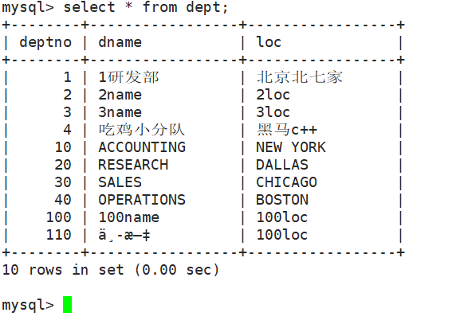

## 00. 目录

[TOC]

##01.  Navicate连接MySQL数据库


**注意**

MySQL数据库，默认只支持本地访问。首次远程访问通常会看到错误提示信息：

**Access denied for user ‘root’@’192.168.1.1’(using passswrod:YES)**


**原因:**

​	MySQL默认只支持本地访问


**解决办法:**

第一步: 编辑mysql配置文件，把其中bind-address = 127.0.0.1注释了

	[test1@deng 4th]$ vim /usr/my.cnf 


第二步: 使用root进入mysql命令行，执行如下2个命令，示例中mysql的root账号密码：123456

>     mysql> mysql –u root -p 123456       
>
>     mysql> use mysql;  
>
>     mysql> update user set host = '%' where user = 'root';
>
>     mysql> flush privileges;

  第一句：以权限用户root登录

  第二句：选择mysql库

  第三句：修改host值（以通配符%的内容增加主机/IP地址），也可以直接增加IP地址

  第四句：刷新MySQL的系统权限相关表


第三步: 重启mysql服务

>[test1@deng 4th]$ systemctl restart mysql


## 02. 开发前准备

1. 安装MySQL对应的安装包

2. 找到对应的头文件

   >[root@deng ~]# locate mysql.h
   >**/usr/include/mysql/mysql.h**  <---对应的头文件
   >/usr/share/doc/rsyslog-5.8.10/ommysql.html
   >/usr/share/doc/rsyslog-5.8.10/rsyslog_mysql.html

3. 找到对应的库文件

   >[root@deng ~]# locate libmysqlclient.a
   >**/usr/lib64/mysql/libmysqlclient.a**


4. 找到对应的开发手册, 查看对应的API接口


## 03. 编程步骤

1. 通过调用mysql_init()初始化连接处理程序，得到句柄
2. 通过调用mysql_real_connect()连接到服务器。
3. 发出SQL语句并处理其结果。
4. 通过调用mysql_close()，关闭与MySQL服务器的连接。


## 04. 初始化和连接到MySQL

mysql_init函数

```C
MYSQL *mysql_init(MYSQL *mysql) 
功能:
	分配或初始化与mysql_real_connect()相适应的MYSQL对象。如果mysql是NULL指针，该函数将分配、初始化、并返回新对象。否则，将初始化对象，并返回对象的地址。如果mysql_init()分配了新的对象，当调用mysql_close()来关闭连接时。将释放该对象。

参数:
	mysql: 一般填写NULL, 会自动分配 初始化和返回对象

返回值:
	初始化的MYSQL*句柄。如果无足够内存以分配新的对象，返回NULL。
	
	
```


mysql_close函数:

```C
void mysql_close(MYSQL *mysql) 
功能:
	关闭前面打开的连接。如果句柄是由mysql_init()或mysql_connect()自动分配的，mysql_close()还将解除分配由mysql指向的连接句柄
	
参数:
	mysql:  是mysql_init的返回值

返回值:
	无
```


mysql_real_connect函数

```C
MYSQL *mysql_real_connect(MYSQL *mysql, const char *host, const char *user, const char *passwd, const char *db, unsigned int port, const char *unix_socket, unsigned long client_flag) 

功能:
	mysql_real_connect()尝试与运行在主机上的MySQL数据库引擎建立连接。在你能够执行需要有效MySQL连接句柄结构的任何其他API函数之前，mysql_real_connect()必须成功完成。

参数:
	mysql: mysql_init返回值, 初始化好的句柄
	host: 主机名或IP地址
	user: 数据库用户名
	passwd: 数据库对应用户名的密码
	db: 数据库名称
	port: 0表示使用默认的端口
	unix_socket: 一般填写NULL
	client_flag: 通常为0

返回值:
	如果连接成功，返回MYSQL*连接句柄。如果连接失败，返回NULL。对于成功的连接，返回值与第1个参数的值相同。

```


测试代码:

```C
#include <stdio.h>
#include <string.h>
#include <stdlib.h>
#include <mysql/mysql.h>

#define _HOST_ "192.168.73.36"
#define _USER_ "root"
#define _PASSWD_ "123456"
#define _DB_ "scott"

//初始化  关闭
int main(void)
{
    MYSQL *mysql = NULL;

    //1. 初始化一个句柄
    mysql = mysql_init(NULL);
    if (NULL == mysql)
    {
        printf("mysql_init failed...\n"); 
        return 1;
    }
    printf("mysql_init ok....\n");

    
    //2. 连接mysql数据库
    mysql = mysql_real_connect(mysql, _HOST_, _USER_, _PASSWD_, _DB_, 0, NULL, 0); 
    if (NULL == mysql)
    {
        printf("连接mysql数据库失败...\n"); 
    }
    else
    {
        printf("连接mysql数据库成功....\n"); 
    }


    //3. 关闭连接
    mysql_close(mysql);    

    return 0;
}

```


编译方法:


RedHat6.5版本

>[test1@deng 4th]$ gcc 1mysql_init.c -L/usr/lib64/mysql  -lmysqlclient -lm -ldl -lpthread  -lrt -lstdc++

Centos7.5版本

```powershell
[deng@localhost code]$ gcc 1mysql_init.c -L/usr/lib64/mysql -lmysqlclient
```


## 05. 执行SQL语句(增删改查)

mysql_query函数

```C
int mysql_query(MYSQL *mysql, const char *query) 
功能:
	执行由“Null终结的字符串”查询指向的SQL查询。正常情况下，字符串必须包含1条SQL语句，而且不应为语句添加终结分号（‘;’）或“\g”。如果允许多语句执行，字符串可包含多条由分号隔开的语句

参数:
	mysql: 是mysql_real_connect连接成功之后的句柄
	query: 对应的SQL语句
	
返回值:
	如果查询成功，返回0。如果出现错误，返回非0值。 

```


简单的Makefile编写:

```Makefile
#获取当前目录中所有的.c文件
SRC:=$(wildcard *.c)
#去掉所有的.c后缀
BIN:=$(patsubst %.c, %, $(SRC))

#头文件的目录
INC:=/usr/lib64/mysql
#链接的库
LIB:= -lmysqlclient -lm -ldl -lpthread  -lrt -lstdc++

#目标:依赖
all:$(BIN)

#将对应的.c生成对应的可执行文件
%:%.c
	gcc $< -L$(INC) $(LIB) -o $@

.PHONY:clean
clean:
	rm -rf *.o $(BIN)

```


执行插入的代码:

```c
#include <stdio.h>
#include <string.h>
#include <stdlib.h>
#include <mysql/mysql.h>

#define _HOST_ "192.168.73.36"
#define _USER_ "root"
#define _PASSWD_ "123456"
#define _DB_ "scott"

#define SIZE 128

//初始化  关闭
int main(void)
{
    int ret = -1;

    MYSQL *mysql = NULL;

    char buf[SIZE];

    //1. 初始化一个句柄
    mysql = mysql_init(NULL);
    if (NULL == mysql)
    {
        printf("mysql_init failed...\n"); 
        return 1;
    }
    printf("mysql_init ok....\n");

    
    //2. 连接mysql数据库
    mysql = mysql_real_connect(mysql, _HOST_, _USER_, _PASSWD_, _DB_, 0, NULL, 0); 
    if (NULL == mysql)
    {
        printf("连接mysql数据库失败...\n"); 
    }
    else
    {
        printf("连接mysql数据库成功....\n"); 
    }

    //3. 执行SQL语句
    memset(buf, 0, SIZE);
    strcpy(buf, "insert into dept values(3, '3name', '3loc')");
    ret = mysql_query(mysql, buf);
    if (0 != ret)
    {
        printf("mysql_query failed....\n"); 
    }
    else
    {
        printf("执行SQL语句ok....\n");
    }


    //4. 关闭连接
    mysql_close(mysql);    

    return 0;
}
```


## 06. 执行SQL语句(删除)


## 07. 执行SQL语句(更新)


## 08. 出错处理

mysql_error函数

```C
const char *mysql_error(MYSQL *mysql) 
功能:
	对于由mysql指定的连接，对于失败的最近调用的API函数，mysql_error()返回包含错误消息的、由Null终结的字符串。如果该函数未失败，mysql_error()的返回值可能是以前的错误，或指明无错误的空字符串。
	经验规则是，如果成功，所有向服务器请求信息的函数均会复位mysql_error()。

参数:
	mysql: MYSQL*句柄
	
返回值:
	返回描述错误的、由Null终结的字符串。如果未出现错误，返回空字符串。
```


 mysql_affected_rows函数:

```C
my_ulonglong mysql_affected_rows(MYSQL *mysql) 
功能:
	返回上次UPDATE更改的行数，上次DELETE删除的行数，或上次INSERT语句插入的行数。对于UPDATE、DELETE或INSERT语句，可在mysql_query()后立刻调用。对于SELECT语句，mysql_affected_rows()的工作方式与mysql_num_rows()类似。
	
参数:
	mysql: MYSQL*句柄
	
返回值:
	大于0的整数表明受影响或检索的行数。“0”表示UPDATE语句未更新记录，在查询中没有与WHERE匹配的行，或未执行查询。“-1”表示查询返回错误，或者，对于SELECT查询，在调用mysql_store_result()之前调用了mysql_affected_rows()。由于mysql_affected_rows()返回无符号值，通过比较返回值和“(my_ulonglong)-1”或等效的“(my_ulonglong)~0”，检查是否为“-1”。

```


## 09. 执行SQL语句(select)

1. 通过调用mysql_init()初始化连接处理程序，得到句柄
2. 通过调用mysql_real_connect()连接到服务器。
3. 执行sql语句
4. 获取查询的结果
5. 通过调用mysql_close()，关闭与MySQL服务器的连接。


mysql_store_result函数

```C
MYSQL_RES *mysql_store_result(MYSQL *mysql) 
功能:
	将查询的全部结果读取到客户端，分配1个MYSQL_RES结构，并将结果置于该结构中。
参数:
	句柄
返回值:
	具有多个结果的MYSQL_RES结果集合。如果出现错误，返回NULL。 
```


mysql_num_rows()函数

```C
my_ulonglong mysql_num_rows(MYSQL_RES *result) 
功能:
	返回结果集中的行数。
参数:
	MYSQL_RES结果集指针, mysql_store_result返回值
	
返回值:
	结果集中的行数。
```


mysql_fetch_row()函数

```C
MYSQL_ROW mysql_fetch_row(MYSQL_RES *result) 
功能:
	检索结果集的下一行。
参数:
	MYSQL_RES结果集指针, mysql_store_result返回值
	
返回值:
	下一行的MYSQL_ROW结构。如果没有更多要检索的行或出现了错误，返回NULL。
```


mysql_num_fields函数

```C
unsigned int mysql_num_fields(MYSQL_RES *result) 
功能:
	获取结果集中列数(字段数)
        
参数:
	MYSQL_RES结果集指针, mysql_store_result返回值
	
返回值:
	返回结果集中的列数。

```


mysql_free_result函数

```C
void mysql_free_result(MYSQL_RES *result) 
功能:
	释放由mysql_store_result()、mysql_use_result()、mysql_list_dbs()等为结果集分配的内存。完成对结果集的操作后，必须调用mysql_free_result()释放结果集使用的内存。

	释放完成后，不要尝试访问结果集。

参数:
	MYSQL_RES结果集指针, mysql_store_result返回值
返回值:
	无

```


## 10. 执行SQL语句(获取表头信息)

mysql_fetch_fields函数

```C
MYSQL_FIELD *mysql_fetch_fields(MYSQL_RES *result) 
功能:
	对于结果集，返回所有MYSQL_FIELD结构的数组。每个结构提供了结果集中1列的字段定义。
参数:
	MYSQL_RES结果集指针, mysql_store_result返回值

返回值:
	关于结果集所有列的MYSQL_FIELD结构的数组。

```

参考示例

```C
unsigned int num_fields;
unsigned int i;
MYSQL_FIELD *fields;
 
num_fields = mysql_num_fields(result);
fields = mysql_fetch_fields(result);
for(i = 0; i < num_fields; i++)
{
   printf("Field %u is %s\n", i, fields[i].name);
}

```


## 11. 实现一个简单的客户端



实现思路分析:

1. 通过调用mysql_init()初始化连接处理程序，得到句柄
2. 通过调用mysql_real_connect()连接到服务器。
3. 循环读取用户输入的sql语句
4. 执行sql语句
5. 如果是查询语句, 获取查询的结果
6. 如果是非查询语句, 获取影响的行数
7. 释放结果集
8. 通过调用mysql_close()，关闭与MySQL服务器的连接。


## 12. MySQL事务


## 13. MySQL预处理


